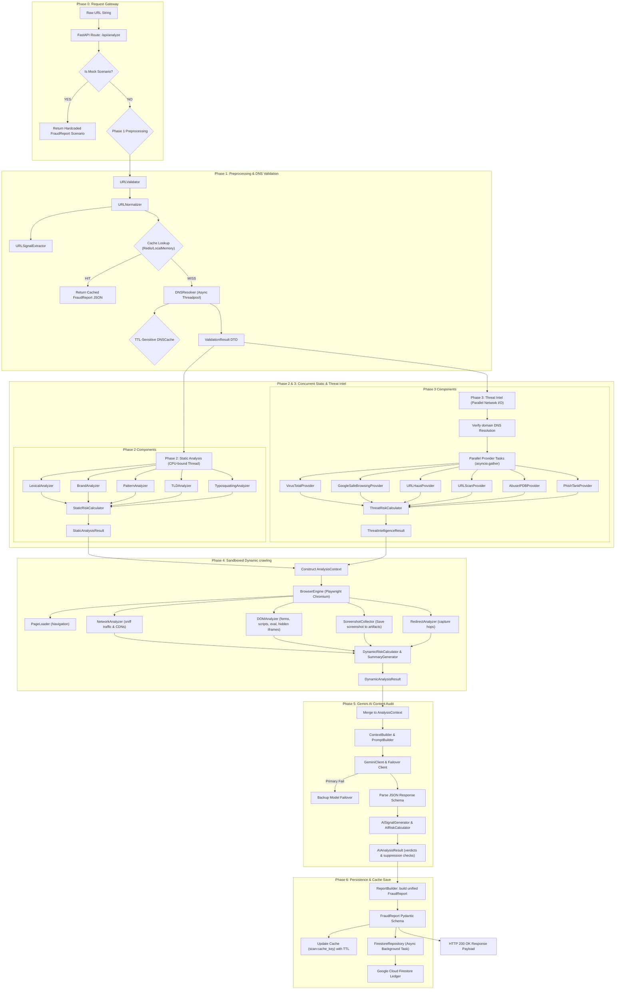
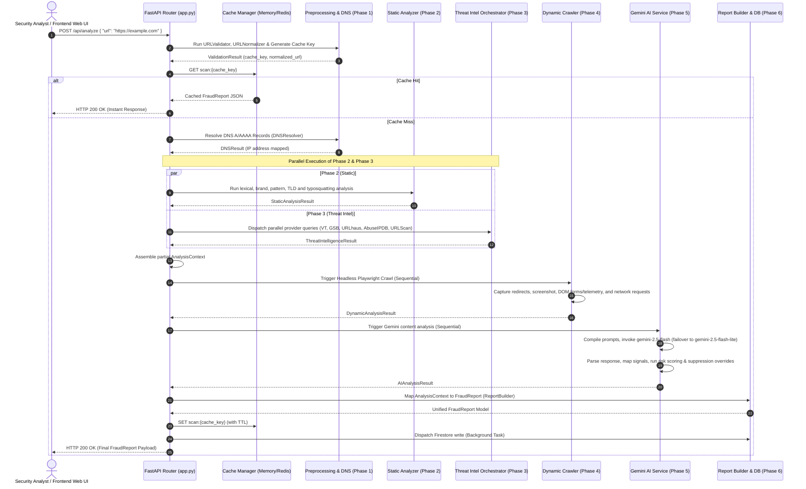

# 🛡️ Enterprise AI URL Safety & Fraud Detection Platform: Technical Workflow

This document details the modular, multi-phase threat assessment pipeline of the platform. It maps the end-to-end processing lifecycle of an incoming URL, detailing the responsibilities, dependencies, inputs, outputs, error recovery paths, and code-level file node locations.

---

## 🗺️ High-Level System Architecture & Flowchart



---

## 🔄 End-to-End Sequence Diagram



---

## 🔍 Detailed Phase-by-Phase Technical Walkthrough

### Phase 0: Request Entry & Caching Gate
The entrypoint intercepts raw client inputs, executes mock scenario redirection for UI testing, check cache status, and manages API lifecycle routines.

*   **Goal**: Provide a clean HTTP interface, isolate client validation issues, and perform fast cache checks to bypass expensive computations.
*   **Step-by-Step Execution**:
    1.  Receive a `POST` request at `/api/analyze`.
    2.  Standardize and clean the input string (strip trailing white space, convert scheme casing).
    3.  Check if the URL contains `"scenario"` and `".test"` keywords. If yes, bypass the execution pipeline and return mock DTO objects corresponding to scenarios 1-7.
    4.  Invoke [URLAnalyzer](file:///d:/Study/test/Audio/ai_engineer/DP/week10/AI_agent/src/analyzers/url/preprocessing/url_analyzer.py) to build the deterministic `cache_key`.
    5.  Check the caching engine for `scan:{cache_key}`. If it exists, return it immediately. If not, proceed to Phase 1.
*   **Code Nodes & Navigation**:
    *   **FastAPI Router**: [app.py](file:///d:/Study/test/Audio/ai_engineer/DP/week10/AI_agent/src/app.py)
    *   **Analyze Endpoint Handler**: [analyze_url()](file:///d:/Study/test/Audio/ai_engineer/DP/week10/AI_agent/src/app.py#L63)
    *   **Cache Factory Entry**: [get_cache()](file:///d:/Study/test/Audio/ai_engineer/DP/week10/AI_agent/src/core/cache/factory.py)
*   **Data Models**:
    *   *Input*: `AnalyzeRequest` (Pydantic model in [app.py](file:///d:/Study/test/Audio/ai_engineer/DP/week10/AI_agent/src/app.py#L52))
    *   *Output*: `FraudReport` (if cache hit, defined in [fraud_report.py](file:///d:/Study/test/Audio/ai_engineer/DP/week10/AI_agent/src/core/report/fraud_report.py#L23))
*   **Failure Isolation & Resilience**:
    *   If the caching service (Redis) connection drops or times out, the factory logs a warning and fails open, routing the request directly into the live threat pipeline to prevent service outages.

---

### Phase 1: Preprocessing & DNS Validation
Validates the structural format of the URL, extracts basic lexical components, normalizes characters (e.g., handling international domains), and verifies host viability via DNS resolution.

*   **Goal**: Stop parsing invalid or unreachable URLs early and establish standard inputs for downstream analyzers.
*   **Step-by-Step Execution**:
    1.  Parse the raw string with [URLValidator](file:///d:/Study/test/Audio/ai_engineer/DP/week10/AI_agent/src/analyzers/url/preprocessing/validator.py) to assert structure, schemes, and detect disallowed inputs (e.g. private RFC1918 IPs, loopbacks, or malformed syntaxes).
    2.  Pass validation to [URLNormalizer](file:///d:/Study/test/Audio/ai_engineer/DP/week10/AI_agent/src/analyzers/url/preprocessing/normalizer.py) to clean spacing, correct character casings, map Punycode for international domains (IDNs), and calculate the MD5 cache key.
    3.  Slice the domain into subcomponents (scheme, subdomain, domain, TLD) using `tldextract` inside [URLAnalyzer](file:///d:/Study/test/Audio/ai_engineer/DP/week10/AI_agent/src/analyzers/url/preprocessing/url_analyzer.py#L70).
    4.  Extract preliminary structural threat indicators (such as IP address hosts or port definitions) using [URLSignalExtractor](file:///d:/Study/test/Audio/ai_engineer/DP/week10/AI_agent/src/analyzers/url/preprocessing/signal_extractor.py).
    5.  Trigger [DNSResolver](file:///d:/Study/test/Audio/ai_engineer/DP/week10/AI_agent/src/dns/resolver.py) asynchronously to retrieve A, AAAA, or MX IP records. Check the local [DNSCache](file:///d:/Study/test/Audio/ai_engineer/DP/week10/AI_agent/src/dns/cache.py) before dispatching network socket queries.
*   **Code Nodes & Navigation**:
    *   **Core Analyzer Coordinator**: [URLAnalyzer.analyze()](file:///d:/Study/test/Audio/ai_engineer/DP/week10/AI_agent/src/analyzers/url/preprocessing/url_analyzer.py#L31)
    *   **Input Structural Sanitizer**: [URLNormalizer](file:///d:/Study/test/Audio/ai_engineer/DP/week10/AI_agent/src/analyzers/url/preprocessing/normalizer.py)
    *   **Infrastructure DNS resolver**: [DNSResolver.resolve()](file:///d:/Study/test/Audio/ai_engineer/DP/week10/AI_agent/src/dns/resolver.py#L19)
    *   **Socket Worker thread query**: [resolve_dns()](file:///d:/Study/test/Audio/ai_engineer/DP/week10/AI_agent/src/dns/dnspython_resolver.py)
*   **Data Models**:
    *   *Input*: Raw URL String.
    *   *Output*: `ValidationResult` (defined in [models.py](file:///d:/Study/test/Audio/ai_engineer/DP/week10/AI_agent/src/core/models.py#L19)) containing cache key, component breakdown, lexical flags, and DNS IP addresses.
*   **Failure Isolation & Resilience**:
    *   If DNS fails to resolve or times out (guard limit: `3.0s`), a negative DNS result is cached with a low TTL (`300s`) to prevent DNS-flood resource starvation, and the main pipeline halts, returning a clean HTTP 400 validation error.

---

### Phase 2: Static Heuristics & Lexical Analysis
Performs CPU-bound lexical computation, keyword checks, typosquatting checks, and metadata scoring without issuing outbound web requests. Runs concurrently with Phase 3 using `asyncio.gather`.

*   **Goal**: Generate local threat profiles immediately and catch obvious lookalike phishing domains.
*   **Step-by-Step Execution**:
    1.  Invoke [LexicalAnalyzer](file:///d:/Study/test/Audio/ai_engineer/DP/week10/AI_agent/src/analyzers/url/static/lexical_analyzer.py) to measure URL length, subdomain depths, digit ratios, symbol frequency, token sizes, and compute domain entropy.
    2.  Invoke [BrandAnalyzer](file:///d:/Study/test/Audio/ai_engineer/DP/week10/AI_agent/src/analyzers/url/static/brand_analyzer.py) to parse brand lists and check if corporate names appear incorrectly in subdomains or path tokens.
    3.  Invoke [PatternAnalyzer](file:///d:/Study/test/Audio/ai_engineer/DP/week10/AI_agent/src/analyzers/url/static/pattern_analyzer.py) to detect double extensions (`.pdf.exe`), suspicious keywords (e.g. `secure`, `login`, `bank`, `update`), url shortener patterns, and encoded characters.
    4.  Invoke [TLDAnalyzer](file:///d:/Study/test/Audio/ai_engineer/DP/week10/AI_agent/src/analyzers/url/static/tld_analyzer.py) to check registry risk reputation records (categorizing TLDs into low, medium, and high threat buckets).
    5.  Invoke [TyposquattingAnalyzer](file:///d:/Study/test/Audio/ai_engineer/DP/week10/AI_agent/src/analyzers/url/static/typosquatting_analyzer.py) to calculate Levenshtein distance against known high-profile brand domains (e.g. `g00gle.com` typos).
    6.  Accumulate all indicators in [StaticRiskCalculator](file:///d:/Study/test/Audio/ai_engineer/DP/week10/AI_agent/src/analyzers/url/static/static_risk_calculator.py) to compute a weighted, bounded static score out of 100.
*   **Code Nodes & Navigation**:
    *   **Static Phase Coordinator**: [StaticURLAnalyzer.analyze()](file:///d:/Study/test/Audio/ai_engineer/DP/week10/AI_agent/src/analyzers/url/static/static_url_analyzer.py#L42)
    *   **Entropy & Heuristics engine**: [LexicalAnalyzer](file:///d:/Study/test/Audio/ai_engineer/DP/week10/AI_agent/src/analyzers/url/static/lexical_analyzer.py)
    *   **Distance calculation engine**: [TyposquattingAnalyzer](file:///d:/Study/test/Audio/ai_engineer/DP/week10/AI_agent/src/analyzers/url/static/typosquatting_analyzer.py)
    *   **Static Risk Score calculator**: [StaticRiskCalculator](file:///d:/Study/test/Audio/ai_engineer/DP/week10/AI_agent/src/analyzers/url/static/static_risk_calculator.py)
*   **Data Models**:
    *   *Input*: `ValidationResult`
    *   *Output*: `StaticAnalysisResult` (defined in [models.py](file:///d:/Study/test/Audio/ai_engineer/DP/week10/AI_agent/src/core/models.py#L91)) containing lexical, pattern, brand, typosquatting objects, and the static score.
*   **Failure Isolation & Resilience**:
    *   Because the static module runs locally with no external APIs or network socket lookups, failures are localized. Any unexpected parsing exceptions are caught, and default safe structures with score 0 are returned to guarantee pipeline continuity.

---

### Phase 3: Parallel Threat Intelligence
Queries multiple industry-standard reputation APIs concurrently. Runs in parallel with Phase 2 using `asyncio.gather`.

*   **Goal**: Cross-reference URLs and host IP addresses with external global security databases to identify known threats.
*   **Step-by-Step Execution**:
    1.  Extract the domain and resolved IP address from `ValidationResult`.
    2.  Check the Redis Threat Intel cache for pre-computed reputations.
    3.  Initialize provider wrappers for VirusTotal, Google Safe Browsing, URLScan, URLHaus, AbuseIPDB, and PhishTank.
    4.  Query all active providers in parallel utilizing asynchronous execution context tasks.
    5.  Collect and parse responses, standardizing diverse payloads (like VirusTotal engine vote counts or URLScan scores) into normalized threat signals.
    6.  Compute the compounded risk score and establish a confidence ratio using the [ThreatRiskCalculator](file:///d:/Study/test/Audio/ai_engineer/DP/week10/AI_agent/src/analyzers/url/threat_intelligence/risk/threat_risk_calculator.py).
*   **Code Nodes & Navigation**:
    *   **Threat Intel Orchestrator**: [ThreatIntelOrchestrator.analyze_url()](file:///d:/Study/test/Audio/ai_engineer/DP/week10/AI_agent/src/analyzers/url/threat_intelligence/orchestrator.py#L65)
    *   **Threat Risk Calculator**: [ThreatRiskCalculator](file:///d:/Study/test/Audio/ai_engineer/DP/week10/AI_agent/src/analyzers/url/threat_intelligence/risk/threat_risk_calculator.py)
    *   **VirusTotal Provider**: [VirusTotalProvider](file:///d:/Study/test/Audio/ai_engineer/DP/week10/AI_agent/src/analyzers/url/threat_intelligence/provider/virustotal_provider.py)
    *   **Google Safe Browsing Provider**: [GoogleSafeBrowsingProvider](file:///d:/Study/test/Audio/ai_engineer/DP/week10/AI_agent/src/analyzers/url/threat_intelligence/provider/google_safe_browsing_provider.py)
    *   **URLScan Provider**: [URLScanProvider](file:///d:/Study/test/Audio/ai_engineer/DP/week10/AI_agent/src/analyzers/url/threat_intelligence/provider/urlscan_provider.py)
    *   **AbuseIPDB IP Rep Provider**: [AbuseIPDBProvider](file:///d:/Study/test/Audio/ai_engineer/DP/week10/AI_agent/src/analyzers/url/threat_intelligence/provider/abuseipdb_provider.py)
    *   **URLHaus Provider**: [URLHausProvider](file:///d:/Study/test/Audio/ai_engineer/DP/week10/AI_agent/src/analyzers/url/threat_intelligence/provider/urlhaus_provider.py)
    *   **PhishTank Provider**: [PhishTankProvider](file:///d:/Study/test/Audio/ai_engineer/DP/week10/AI_agent/src/analyzers/url/threat_intelligence/provider/phishtank_provider.py)
*   **Data Models**:
    *   *Input*: `ValidationResult` (containing domain and IP context).
    *   *Output*: `ThreatIntelligenceResult` (defined in [models.py](file:///d:/Study/test/Audio/ai_engineer/DP/week10/AI_agent/src/core/models.py#L189)).
*   **Failure Isolation & Resilience**:
    *   Each provider call is isolated inside an try-except block. If a third-party API times out or returns a rate limit error, the orchestrator catches the exception, maps the provider's hit status to `False`, and **scales down the pipeline's overall confidence value** (e.g. 0.8 instead of 1.0 for a single failure) without interrupting the scan.

---

### Phase 4: Sandboxed Dynamic Browser Crawling
Launches a headless Playwright Chromium instance to load the target URL, tracking redirects, capturing DOM structures, recording network traffic, and saving a screenshot.

*   **Goal**: Assess live, client-side behaviors of modern Javascript-heavy websites that bypass static heuristics.
*   **Step-by-Step Execution**:
    1.  Acquire a Playwright browser context via the [BrowserEngine](file:///d:/Study/test/Audio/ai_engineer/DP/week10/AI_agent/src/analyzers/url/dynamic_analysis/browser_engine.py) context manager.
    2.  Register network request and response event handlers with [NetworkAnalyzer](file:///d:/Study/test/Audio/ai_engineer/DP/week10/AI_agent/src/analyzers/url/dynamic_analysis/network/network_analyzer.py) to sniff live connections, logging endpoints, CDN lookups, third-party calls, and WebSockets.
    3.  Trigger page navigation via [PageLoader](file:///d:/Study/test/Audio/ai_engineer/DP/week10/AI_agent/src/analyzers/url/dynamic_analysis/loader/page_loader.py), following all HTTP redirects.
    4.  Extract the redirection chain history using [RedirectAnalyzer](file:///d:/Study/test/Audio/ai_engineer/DP/week10/AI_agent/src/analyzers/url/dynamic_analysis/redirect/redirect_analyzer.py).
    5.  Audit the rendered DOM in [DOMAnalyzer](file:///d:/Study/test/Audio/ai_engineer/DP/week10/AI_agent/src/analyzers/url/dynamic_analysis/dom/dom_analyzer.py) to search for input fields collecting passwords, credit cards, or identity cards (OTP fields). Scan script tags for obfuscation patterns (`eval()`, `atob()`, `unescape()`) and hidden elements.
    6.  Use [ScreenshotCollector](file:///d:/Study/test/Audio/ai_engineer/DP/week10/AI_agent/src/analyzers/url/dynamic_analysis/screenshot/screenshot_collector.py) to capture a visual screenshot and save it to the local `artifacts/` folder.
    7.  Aggregate the telemetry inside [DynamicRiskCalculator](file:///d:/Study/test/Audio/ai_engineer/DP/week10/AI_agent/src/analyzers/url/dynamic_analysis/risk/dynamic_risk_calculator.py) to calculate the dynamic threat score, applying score mitigations if the domain belongs to a verified trusted platform.
*   **Code Nodes & Navigation**:
    *   **Dynamic Coordinator**: [DynamicAnalysisOrchestrator.analyze()](file:///d:/Study/test/Audio/ai_engineer/DP/week10/AI_agent/src/analyzers/url/dynamic_analysis/orchestrator.py#L47)
    *   **Playwright Engine Manager**: [BrowserEngine](file:///d:/Study/test/Audio/ai_engineer/DP/week10/AI_agent/src/analyzers/url/dynamic_analysis/browser_engine.py)
    *   **DOM Input Auditor**: [DOMAnalyzer](file:///d:/Study/test/Audio/ai_engineer/DP/week10/AI_agent/src/analyzers/url/dynamic_analysis/dom/dom_analyzer.py)
    *   **Network Packet Logger**: [NetworkAnalyzer](file:///d:/Study/test/Audio/ai_engineer/DP/week10/AI_agent/src/analyzers/url/dynamic_analysis/network/network_analyzer.py)
    *   **Screenshot Saver**: [ScreenshotCollector](file:///d:/Study/test/Audio/ai_engineer/DP/week10/AI_agent/src/analyzers/url/dynamic_analysis/screenshot/screenshot_collector.py)
*   **Data Models**:
    *   *Input*: `AnalysisContext` (validation state details).
    *   *Output*: `DynamicAnalysisResult` (defined in [models.py](file:///d:/Study/test/Audio/ai_engineer/DP/week10/AI_agent/src/core/models.py#L281)) containing DOM, network, redirect data, screenshot paths, and dynamic risk scores.
*   **Failure Isolation & Resilience**:
    *   Dynamic crawling tasks are isolated. If navigation fails, if the site returns a 404, or if Playwright crashes, the orchestrator returns a `failed` status result. The main pipeline catches this gracefully, bypasses visual screenshot processing, and moves on to the AI audit phase without stalling.

---

### Phase 5: Gemini AI Content Analysis & Reasoning
Invokes Google Gemini with structured security context inputs (screenshot evidence, DOM, threat signals, and lexical metadata) to generate natural language reasoning, brand detection, and safety decisions.

*   **Goal**: Add generative reasoning to identify brand spoofing and visual duplication that rules engines miss.
*   **Step-by-Step Execution**:
    1.  Compile visual and metadata context using `build_context` in [context_builder.py](file:///d:/Study/test/Audio/ai_engineer/DP/week10/AI_agent/src/analyzers/url/ai_content_analysis/input/context_builder.py). If a screenshot exists, convert it to a Base64-encoded payload.
    2.  Build the system prompts and user analysis prompts using [builder.py](file:///d:/Study/test/Audio/ai_engineer/DP/week10/AI_agent/src/analyzers/url/ai_content_analysis/prompt/builder.py), specifying the JSON output schema constraints.
    3.  Submit the prompt request to the [Gemini Client](file:///d:/Study/test/Audio/ai_engineer/DP/week10/AI_agent/src/analyzers/url/ai_content_analysis/client/gemini_client.py) using the primary model configuration (`gemini-2.5-flash`).
    4.  If the primary model throws a quota error (e.g. rate limits) or service exception, invoke the client's retry failover logic to dispatch the request to the backup model (`gemini-2.5-flash-lite`).
    5.  Parse the raw JSON text response from the API using [parser.py](file:///d:/Study/test/Audio/ai_engineer/DP/week10/AI_agent/src/analyzers/url/ai_content_analysis/parser/parser.py) to validate findings against standard schemas.
    6.  Map the findings to structured threat signals and calculate scores using the [AIRiskCalculator](file:///d:/Study/test/Audio/ai_engineer/DP/week10/AI_agent/src/analyzers/url/ai_content_analysis/risk/calculator.py).
    7.  **Apply Security Scoring Rules**:
        *   **Official Brand Suppression**: If the recommended action is `ALLOW`, override the threat score to `0.0`.
        *   **Decision Score Floors**: Enforce minimum scoring thresholds based on the verdict (e.g., minimum score of `70` for a `BLOCK` verdict, `40` for `WARN`, `20` for `MONITOR`).
*   **Code Nodes & Navigation**:
    *   **AI Phase Coordinator**: [AIContentAnalysisOrchestrator.analyze()](file:///d:/Study/test/Audio/ai_engineer/DP/week10/AI_agent/src/analyzers/url/ai_content_analysis/orchestrator.py#L23)
    *   **AI Execution Service**: [AIAnalysisService](file:///d:/Study/test/Audio/ai_engineer/DP/week10/AI_agent/src/analyzers/url/ai_content_analysis/service.py)
    *   **Model Vendor Client**: [GeminiClient](file:///d:/Study/test/Audio/ai_engineer/DP/week10/AI_agent/src/analyzers/url/ai_content_analysis/client/gemini_client.py)
    *   **Prompt Formatting Engine**: [Prompt Builder](file:///d:/Study/test/Audio/ai_engineer/DP/week10/AI_agent/src/analyzers/url/ai_content_analysis/prompt/builder.py)
    *   **Response Parser**: [AIResponseParser](file:///d:/Study/test/Audio/ai_engineer/DP/week10/AI_agent/src/analyzers/url/ai_content_analysis/parser/parser.py)
    *   **AI Risk Calculator & Suppressor**: [AIRiskCalculator.calculate()](file:///d:/Study/test/Audio/ai_engineer/DP/week10/AI_agent/src/analyzers/url/ai_content_analysis/risk/calculator.py#L17)
*   **Data Models**:
    *   *Input*: Complete `AnalysisContext` (merged results of Phases 1-4).
    *   *Output*: `AIAnalysisResult` (defined in [models.py](file:///d:/Study/test/Audio/ai_engineer/DP/week10/AI_agent/src/core/models.py#L296)) listing brand details, reasoning, recommended actions, and AI risk scores.
*   **Failure Isolation & Resilience**:
    *   If both the primary and backup Gemini client calls fail, the exception is caught. The orchestrator compiles the system and user prompts and saves them to the context, then stores the error string in `context.ai.error`. This enables the frontend UI to display the compiled prompts in the diagnostic copy-paste card so analysts can manually query Gemini.

---

### Phase 6: Persistence & Cache Management
Compiles all data into a unified, decoupled report structure, writes the result to the cache, and persists a permanent record to Google Cloud Firestore.

*   **Goal**: Cache results to speed up future scans and maintain an audit log of past scans.
*   **Step-by-Step Execution**:
    1.  Pass `AnalysisContext` to [ReportBuilder](file:///d:/Study/test/Audio/ai_engineer/DP/week10/AI_agent/src/core/report/builder.py) to construct the finalized Pydantic `FraudReport` model, generating a unique UUID.
    2.  Write the serialized report payload to the cache engine under the namespace `scan:{cache_key}` using the configured TTL (`settings.cache_ttl`, defaulting to 24 hours).
    3.  Register a background task with FastAPI to save the report to Google Cloud Firestore via [FirestoreRepository](file:///d:/Study/test/Audio/ai_engineer/DP/week10/AI_agent/src/core/database/firestore_repository.py) to avoid delaying the API response.
    4.  Return the final `FraudReport` JSON to the user.
*   **Code Nodes & Navigation**:
    *   **Report Mapping Engine**: [ReportBuilder.build()](file:///d:/Study/test/Audio/ai_engineer/DP/week10/AI_agent/src/core/report/builder.py#L10)
    *   **Firestore Access Layer**: [FirestoreRepository.save_report()](file:///d:/Study/test/Audio/ai_engineer/DP/week10/AI_agent/src/core/database/firestore_repository.py#L48)
    *   **API Cache Write**: [app.py (lines 374-375)](file:///d:/Study/test/Audio/ai_engineer/DP/week10/AI_agent/src/app.py#L374)
*   **Data Models**:
    *   *Input*: Complete runtime `AnalysisContext`.
    *   *Output*: Unified `FraudReport` Pydantic model (defined in [fraud_report.py](file:///d:/Study/test/Audio/ai_engineer/DP/week10/AI_agent/src/core/report/fraud_report.py#L23)).
*   **Failure Isolation & Resilience**:
    *   Database writes run in the background. If GCP credentials expire or Firestore is unavailable, the system logs an error without interrupting the response or blocking the UI.

---

## 🛠️ Detailed Node Directory & Link Reference

The following index matches every phase node to its Python module/class definition and provides navigation links:

| Phase | Component Node | Core Class / Method | Absolute File Navigation Link |
| :--- | :--- | :--- | :--- |
| **0** | FastAPI API Gateway | [FastAPI router](file:///d:/Study/test/Audio/ai_engineer/DP/week10/AI_agent/src/app.py) | [app.py](file:///d:/Study/test/Audio/ai_engineer/DP/week10/AI_agent/src/app.py) |
| **0** | API Entrypoint Handler | `analyze_url()` | [app.py#L63](file:///d:/Study/test/Audio/ai_engineer/DP/week10/AI_agent/src/app.py#L63) |
| **0** | Cache Manager Entry | `get_cache()` | [factory.py](file:///d:/Study/test/Audio/ai_engineer/DP/week10/AI_agent/src/core/cache/factory.py) |
| **1** | Phase 1 Preprocessor | `URLAnalyzer.analyze()` | [url_analyzer.py#L31](file:///d:/Study/test/Audio/ai_engineer/DP/week10/AI_agent/src/analyzers/url/preprocessing/url_analyzer.py#L31) |
| **1** | URL Sanitizer Engine | `URLNormalizer` | [normalizer.py](file:///d:/Study/test/Audio/ai_engineer/DP/week10/AI_agent/src/analyzers/url/preprocessing/normalizer.py) |
| **1** | Structural Constraint Engine | `URLValidator` | [validator.py](file:///d:/Study/test/Audio/ai_engineer/DP/week10/AI_agent/src/analyzers/url/preprocessing/validator.py) |
| **1** | Infrastructure Resolver | `DNSResolver.resolve()` | [resolver.py#L19](file:///d:/Study/test/Audio/ai_engineer/DP/week10/AI_agent/src/dns/resolver.py#L19) |
| **2** | Phase 2 Static Coordinator | `StaticURLAnalyzer.analyze()` | [static_url_analyzer.py#L42](file:///d:/Study/test/Audio/ai_engineer/DP/week10/AI_agent/src/analyzers/url/static/static_url_analyzer.py#L42) |
| **2** | Entropy & Token Analyzer | `LexicalAnalyzer` | [lexical_analyzer.py](file:///d:/Study/test/Audio/ai_engineer/DP/week10/AI_agent/src/analyzers/url/static/lexical_analyzer.py) |
| **2** | Typo Lookalike Engine | `TyposquattingAnalyzer` | [typosquatting_analyzer.py](file:///d:/Study/test/Audio/ai_engineer/DP/week10/AI_agent/src/analyzers/url/static/typosquatting_analyzer.py) |
| **2** | Static Risk Calculator | `StaticRiskCalculator` | [static_risk_calculator.py](file:///d:/Study/test/Audio/ai_engineer/DP/week10/AI_agent/src/analyzers/url/static/static_risk_calculator.py) |
| **3** | Threat Intelligence Orchestrator | `ThreatIntelOrchestrator.analyze_url()` | [orchestrator.py#L65](file:///d:/Study/test/Audio/ai_engineer/DP/week10/AI_agent/src/analyzers/url/threat_intelligence/orchestrator.py#L65) |
| **3** | Safe Browsing API Provider | `GoogleSafeBrowsingProvider` | [google_safe_browsing_provider.py](file:///d:/Study/test/Audio/ai_engineer/DP/week10/AI_agent/src/analyzers/url/threat_intelligence/provider/google_safe_browsing_provider.py) |
| **3** | VirusTotal API Provider | `VirusTotalProvider` | [virustotal_provider.py](file:///d:/Study/test/Audio/ai_engineer/DP/week10/AI_agent/src/analyzers/url/threat_intelligence/provider/virustotal_provider.py) |
| **3** | API Threat Risk Calculator | `ThreatRiskCalculator` | [threat_risk_calculator.py](file:///d:/Study/test/Audio/ai_engineer/DP/week10/AI_agent/src/analyzers/url/threat_intelligence/risk/threat_risk_calculator.py) |
| **4** | Phase 4 Dynamic Coordinator | `DynamicAnalysisOrchestrator.analyze()` | [orchestrator.py#L47](file:///d:/Study/test/Audio/ai_engineer/DP/week10/AI_agent/src/analyzers/url/dynamic_analysis/orchestrator.py#L47) |
| **4** | Playwright Session Creator | `BrowserEngine` | [browser_engine.py](file:///d:/Study/test/Audio/ai_engineer/DP/week10/AI_agent/src/analyzers/url/dynamic_analysis/browser_engine.py) |
| **4** | DOM Parsing Engine | `DOMAnalyzer` | [dom_analyzer.py](file:///d:/Study/test/Audio/ai_engineer/DP/week10/AI_agent/src/analyzers/url/dynamic_analysis/dom/dom_analyzer.py) |
| **4** | Live Connection Sniffer | `NetworkAnalyzer` | [network_analyzer.py](file:///d:/Study/test/Audio/ai_engineer/DP/week10/AI_agent/src/analyzers/url/dynamic_analysis/network/network_analyzer.py) |
| **4** | Visual Screenshot Engine | `ScreenshotCollector` | [screenshot_collector.py](file:///d:/Study/test/Audio/ai_engineer/DP/week10/AI_agent/src/analyzers/url/dynamic_analysis/screenshot/screenshot_collector.py) |
| **5** | Phase 5 AI Coordinator | `AIContentAnalysisOrchestrator.analyze()` | [orchestrator.py#L23](file:///d:/Study/test/Audio/ai_engineer/DP/week10/AI_agent/src/analyzers/url/ai_content_analysis/orchestrator.py#L23) |
| **5** | AI Pipeline Execution Service | `AIAnalysisService` | [service.py](file:///d:/Study/test/Audio/ai_engineer/DP/week10/AI_agent/src/analyzers/url/ai_content_analysis/service.py) |
| **5** | API Failover Client | `GeminiClient` | [gemini_client.py](file:///d:/Study/test/Audio/ai_engineer/DP/week10/AI_agent/src/analyzers/url/ai_content_analysis/client/gemini_client.py) |
| **5** | AI Score Suppressor & Floors | `AIRiskCalculator.calculate()` | [calculator.py#L17](file:///d:/Study/test/Audio/ai_engineer/DP/week10/AI_agent/src/analyzers/url/ai_content_analysis/risk/calculator.py#L17) |
| **6** | Pydantic Schema Mapper | `ReportBuilder.build()` | [builder.py#L10](file:///d:/Study/test/Audio/ai_engineer/DP/week10/AI_agent/src/core/report/builder.py#L10) |
| **6** | Firestore Access Adapter | `FirestoreRepository.save_report()` | [firestore_repository.py#L48](file:///d:/Study/test/Audio/ai_engineer/DP/week10/AI_agent/src/core/database/firestore_repository.py#L48) |

---

## 🧮 Security Scoring Engine Mechanics

The platform evaluates threat risk using a multi-layered scoring matrix:

### 1. Static Risk Score (0 - 100)
Calculated in [StaticRiskCalculator](file:///d:/Study/test/Audio/ai_engineer/DP/week10/AI_agent/src/analyzers/url/static/static_risk_calculator.py).
*   **Rules & Weights**:
    *   Typosquatting detected similarity: `+40`
    *   Homoglyph patterns matched: `+50`
    *   Suspicious keywords match counts: `+15` per keyword
    *   High-risk Top-Level Domain (TLD) extension: `+25`
    *   IP host address: `+50`
    *   Domain entropy > 4.5: `+15`
*   **Clamping**: Clamped to a maximum value of `100.0`.

### 2. Threat Intelligence Compounded Score (0 - 100)
Calculated in [ThreatRiskCalculator](file:///d:/Study/test/Audio/ai_engineer/DP/week10/AI_agent/src/analyzers/url/threat_intelligence/risk/threat_risk_calculator.py).
*   **Threat Vector Weights**:
    *   *Blacklist Matches* (GSB, VT malicious flags > 3): Mapped directly to score `100` (`high` risk).
    *   *Behavioral Detections* (URLScan form risks, phishing forms): Mapped to score `95` (`high` risk).
    *   *Reputation Detections* (AbuseIPDB IP scores > 80): Mapped to score `75` (`high` risk).
*   **Confidence Weighting**: Mapped dynamically based on the ratio of active API integrations that succeeded. If 4 out of 5 engines resolved successfully, the confidence drops to `0.8`.

### 3. Dynamic Analysis Risk Score (0 - 100)
Calculated in [DynamicRiskCalculator](file:///d:/Study/test/Audio/ai_engineer/DP/week10/AI_agent/src/analyzers/url/dynamic_analysis/risk/dynamic_risk_calculator.py).
*   **Behavioral Rules**:
    *   Password input field inside an insecure form context: `+80`
    *   OTP verification credentials gathered: `+90`
    *   Hidden iframe redirects or hidden forms: `+40`
    *   Obfuscated Javascript statements (`eval()`, `atob()` counts): `+30` per occurrences
*   **Trusted Platform Suppressions**: Suppresses dynamic form threat flags if the domain resides on a verified, trusted platform list (e.g. google.com).

### 4. Generative AI Risk Score (0 - 100)
Calculated in [AIRiskCalculator](file:///d:/Study/test/Audio/ai_engineer/DP/week10/AI_agent/src/analyzers/url/ai_content_analysis/risk/calculator.py).
*   **Signals & Multipliers**:
    *   Risk score = $\sum (\text{Signal Weight} \times \text{Severity Multiplier} \times \text{Signal Confidence})$
*   **Safety Overrides**:
    *   **Official Brand Suppression**: If the final recommended action is `ALLOW`, the score is set to `0.0`.
    *   **Verdict Floors**: If the action is `BLOCK`, the score is set to `max(score, 70.0)`. If `WARN`, `max(score, 40.0)`. If `MONITOR`, `max(score, 20.0)`.

---

## 🧭 Web UI Navigation Flow & Tab Breakdown

The frontend dashboard serves as the control panel for security operators. Below is the navigation workflow for the user interface:

```
[Web UI URL Input Header]
   │
   ├─► [Submit Scan Request] ──► (Activates loading spinner overlays)
   │
   └─► [Results Tabs Container]
         │
         ├───► Tab 1: Static Heuristics Widget
         │        ├── Risk circular progress gauge
         │        └── Heuristics breakdown: lexical, brand, pattern, TLD, typosquatting cards
         │
         ├───► Tab 2: Threat Intelligence Reputation Widget
         │        ├── Compounded risk score & API confidence metrics
         │        ├── Triggered threat signals badge listings
         │        └── Individual engine diagnostic status cards (VirusTotal, GSB, etc.)
         │
         ├───► Tab 3: Sandboxed Dynamic crawler Widget
         │        ├── Redirection path history chain
         │        ├── DOM telemetry: input forms (pass/otp), hidden iframes, JS audits
         │        ├── Network traffic logs: CDN count, external calls, WebSockets
         │        └── Page screenshot visual evidence viewer
         │
         └───► Tab 4: Gemini AI Verdict Widget
                  ├── AI decision badge: ALLOW / WARN / BLOCK
                  ├── LLM analysis insights: website purpose & fraud categories
                  ├── Prompt Engineering Copy-Paste diagnostic card (System & User prompts)
                  └── Pre-set sample threat scenario templates
```

### 📋 UI Navigation Nodes

1.  **URL Scanning Input Header**:
    *   Accepts a raw URL string.
    *   Provides sample scenario buttons to load test templates (`Google.com`, `scenario2`, `scenario3`).
2.  **Interactive Results Tabs**:
    *   **Static Heuristics**: Displays the initial lexical analysis risk rating and highlights suspicious components (e.g. typosquatting flags).
    *   **Threat Intelligence**: Shows the results of parallel external API scans (VirusTotal, GSB, etc.).
    *   **Dynamic Analysis**: Visualizes the headless Playwright session, including the redirection chain, DOM telemetry, and page screenshot.
    *   **AI Content Analysis**: Displays Gemini's security verdict, reasoning steps, and the **Prompt Engineering Panel** containing system and user prompts for testing.
3.  **History Sliding Side Drawer**:
    *   Opened via the **History** button in the header.
    *   Fetches the scan history log from `/api/history`.
    *   Provides filters to search by URL and filter by final verdict (ALLOW, WARN, BLOCK).
    *   Clicking a history item loads the report's diagnostic state instantly.

---

## 🧪 Simulation Harness Scenarios

To verify the scoring engines and pipeline resilience, the application includes mock scenario mapping:

| Scenario ID | Trigger URL | Simulated Phase Metrics & Signal Detections | Expected Score & Verdict |
| :--- | :--- | :--- | :--- |
| **Scenario 1** | `*scenario1*.test` | Clean site simulation. No threat triggers. | `0` risk score (LOW/ALLOW) |
| **Scenario 2** | `*scenario2*.test` | Blacklist detection simulator. Triggers `GOOGLE_BLACKLIST` & `VT_CONFIRMED_MALICIOUS`. AI flags Google brand impersonation. | `52.5` AI risk score (HIGH/BLOCK) |
| **Scenario 3** | `*scenario3*.test` | Phishing form simulation. Triggers `PHISHING_FORM_DETECTED` and credential harvesting DOM signatures. | `90.0` AI risk score (CRITICAL/BLOCK) |
| **Scenario 4** | `*scenario4*.test` | IP/Proxy reputation simulation. Triggers `ABUSEIPDB_HIGH_CONFIDENCE_MALICIOUS` (92% IP score). | `15.0` risk score (MEDIUM/ALLOW) |
| **Scenario 5** | `*scenario5*.test` | Partial API timeout isolation. VirusTotal lookup fails. Pipeline confidence drops to `0.8`. | `0` risk score (LOW/ALLOW) |
| **Scenario 6** | `*scenario6*.test` | Cache Hit simulation. Retrieves report from Redis. | Mapped cached score & signals |
| **Scenario 7** | `*scenario7*.test` | Compounded Threat. Triggers all static, threat intel, and dynamic phishing indicators. | `100` threat score (CRITICAL/BLOCK) |

These scenarios can be tested using the unit test suite:
```bash
pytest tests/run_scenarios.py
```
