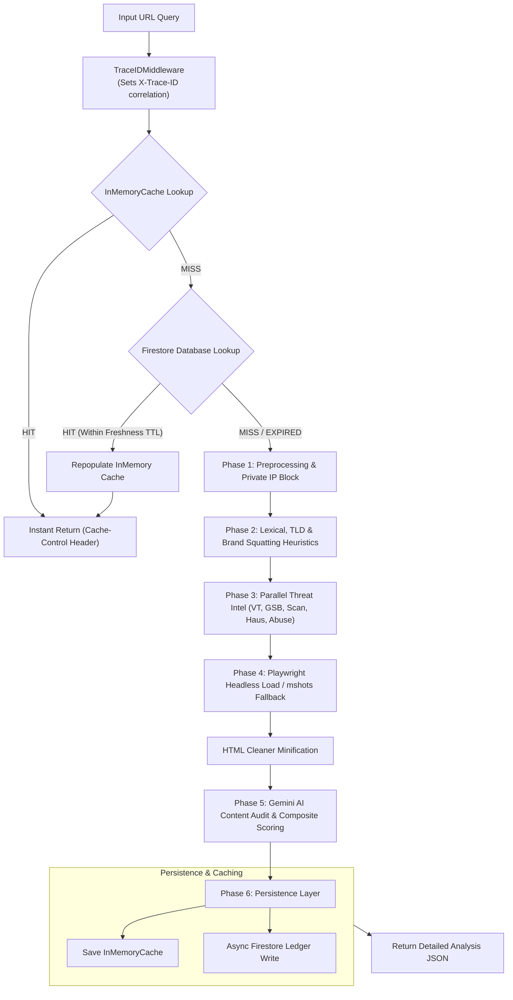
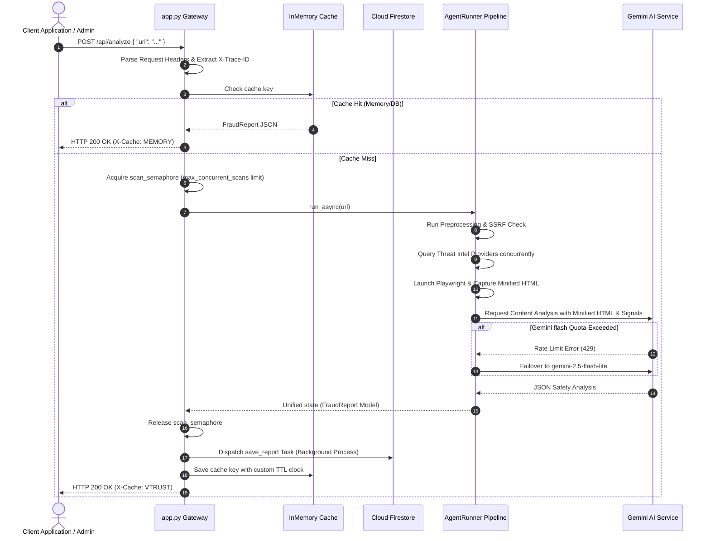

# 🛡️ Enterprise AI URL Safety & Fraud Detection Platform

Welcome to the **Enterprise AI URL Safety & Fraud Detection Platform**—a highly optimized, native asynchronous, multi-phase threat assessment pipeline designed to inspect, validate, analyze, and neutralize malicious URLs.

By combining **static lexical heuristics**, **brand-spoofing detection**, **multi-provider Threat Intelligence (Threat Intel) aggregation**, **sandboxed dynamic browser execution**, **HTML token compression**, and **generative AI reasoning**, this platform offers a deep, 360-degree security assessment of any incoming URL or domain.

---

## 📖 Table of Contents
1. [🚀 Architecture & Design Patterns](#-architecture--design-patterns)
2. [⚡ Performance Optimizations & Benchmarks](#-performance-optimizations--benchmarks)
3. [📊 End-to-End System Workflow & Mermaid Diagrams](#-end-to-end-system-workflow--mermaid-diagrams)
4. [🛠️ Technical Execution Matrix](#%EF%B8%8F-technical-execution-matrix)
5. [🌐 API Endpoint Specification (Schemas)](#-api-endpoint-specification-schemas)
6. [📉 Telemetry, Distributed Tracing & Logging](#-telemetry-distributed-tracing--logging)
7. [🛡️ Resiliency, Failover & Fault Isolation](#%EF%B8%8F-resiliency-failover--fault-isolation)
8. [⚙️ Installation & Production Setup](#%EF%B8%8F-installation--production-setup)
9. [🧪 Simulation & Verification Testing](#-simulation--verification-testing)

---

## 🚀 Architecture & Design Patterns

The platform is designed around **Clean Architecture** and SOLID design principles, dividing the scanning pipeline into independent, decoupled boundaries.

```
┌────────────────────────────────────────────────────────┐
│                      FastAPI Web Gateway               │
│         (TraceIDMiddleware, RateLimiter, Health)       │
└──────────────────────────┬─────────────────────────────┘
                           │
┌──────────────────────────▼─────────────────────────────┐
│                    AgentRunner Engine                  │
│       (Native Async Cascade Workflow Orchestrator)     │
└──────┬───────────────────┬───────────────────┬─────────┘
       │                   │                   │
┌──────▼──────┐     ┌──────▼──────┐     ┌──────▼──────┐
│Pre-process  │     │Threat Intel │     │Dynamic Load │
│(DNS, SSRF)  │     │(5 Providers)│     │(Playwright) │
└─────────────┘     └─────────────┘     └──────┬──────┘
                                               │
                                        ┌──────▼──────┐
                                        │HTML Cleaner │
                                        └──────┬──────┘
                                               │
                                        ┌──────▼──────┐
                                        │ Gemini LLM  │
                                        └──────┬──────┘
                                               │
                                        ┌──────▼──────┐
                                        │ Persistence │
                                        │ (Firestore) │
                                        └─────────────┘
```

### 1. Agent Cascade Pattern (Directed Acyclic Workflow)
Rather than executing linear tasks, the system treats URL verification as a **Cascading Directed Workflow**. The orchestration engine ([runner.py](file:///d:/Study/test/Audio/ai_engineer/DP/week10/vtrust-renew/ai_agent/src/agents/runner.py)) sequentially fires independent async nodes. If early validation steps fail (e.g., DNS resolution fails or a private IP is detected), the agent triggers a **Fast-Exit Strategy** immediately, bypassing external calls to save API quota and compute cycles.

### 2. Strategy Pattern (Decoupled Threat Intelligence)
Every threat intelligence connector (VirusTotal, Google Safe Browsing, URLScan, URLhaus, AbuseIPDB) inherits from a common `BaseProvider` interface. This allows the `ThreatIntelOrchestrator` to loop over all active providers polymorphically, executing their lookup tasks concurrently via `asyncio.gather` with isolated timeout controls.

### 3. Factory & Adapter Patterns (Durable Persistence & Caching)
- **Database Adapter:** The [FirestoreRepository](file:///d:/Study/test/Audio/ai_engineer/DP/week10/vtrust-renew/ai_agent/src/core/database/firestore_repository.py) implements the abstract `BaseRepository` interface, decoupling Firestore-specific calls from business logic.
- **Cache Provider Factory:** The caching engine leverages a factory design pattern to yield either local clock-safe memory cache stores (`InMemoryCache` with a `MAX_SIZE` limit of 200 to prevent OOM) or external cache layers depending on active settings.

---

## ⚡ Performance Optimizations & Benchmarks

To sustain low latency and high throughput in enterprise workloads, the codebase implements the following optimizations:

*   **Fast-Exit Caching Layer:** Features a two-tiered lookup strategy:
    1.  **Tier 1 (In-Memory):** Clock-safe, lock-free thread-safe local cache for O(1) resolution.
    2.  **Tier 2 (Cloud Firestore):** Persistent cache database with dynamic clocks matching verdict safety:
        *   **Whitelisted Domains:** Cached for **30 days**.
        *   **Malicious/Block/Warn Domains:** Cached for **7 days**.
        *   **Clean Domains:** Cached for **24 hours** (allows re-scanning to protect against post-verification hijacking).
        *   **Result:** Under cache-hit conditions, API response time drops to **~0.07 seconds**.
*   **HTTP Connection Pooling:** Powered by a globally managed `httpx.AsyncClient` connection pool configuration (`max_connections=100`, `max_keepalive_connections=20`). This prevents socket resource exhaustion under heavy parallel execution loads.
*   **HTML Minification & Token Reduction (`html_cleaner.py`):** Before sending live-crawled pages to the Gemini LLM, HTML content is aggressively sanitized:
    *   Removes `<script>`, `<style>`, `<svg>`, `<path>`, and link headers.
    *   Strips inline CSS styling and base64 encoded media blobs.
    *   Compresses white spaces.
    *   **Token Savings:** Achieves **80% - 95% reduction** in tokens, lowering API usage costs and accelerating Gemini generation times by over 300%.
*   **Non-Blocking Scraper Fallback:** If dynamic scraping is blocked or fails, the platform instantly falls back to assigning a WordPress mshots URL. The backend issues this URL instantly to the API response, allowing the client browser to asynchronously download the screenshot while releasing backend thread/coroutine locks immediately.

---

## 📊 End-to-End System Workflow & Mermaid Diagrams

### 1. Analysis Lifecycle Loop


### 2. Microservice Sequencer Sequence Diagram


---

## 🛠️ Technical Execution Matrix

| Phase | Module | Input format | Output format | Error Fallback & Isolation |
| :--- | :--- | :--- | :--- | :--- |
| **Phase 1** | `preprocessing/` | Raw URL string | `ValidationResult` | Blocks private IPs (SSRF). Invalid URLs exit early with HTTP 400. |
| **Phase 2** | `static/` | Parsed Hostname | `StaticRiskAnalysis` | Rules-based engine with no external API calls. Zero network failures possible. |
| **Phase 3** | `threat_intelligence/` | Domain / IPs | `ThreatIntelligenceResult` | Errors or rate limits from single providers are isolated. Overall confidence score falls back proportionally. |
| **Phase 4** | `dynamic_analysis/` | Target URL | `DynamicAnalysisResult` | Playwright errors trigger direct WordPress mshots fallback without blocking pipeline. |
| **Phase 5** | `ai_content_analysis/` | Screenshots & Minified HTML | `AIAnalysisResult` | Failover to backup model (`flash-lite`). Diagnostic prompting payload falls back to UI card on failure. |
| **Phase 6** | `persistence/` | `FraudReport` Model | Document Reference ID | Performed as an asynchronous Background Task; database offline doesn't disrupt user response. |

---

## 🌐 API Endpoint Specification (Schemas)

### 1. `POST /api/analyze`
**Request Payload:**
```json
{
  "url": "https://secure-login-vietnam.vn",
  "language": "vi"
}
```

**Response Payload (HTTP 200 OK):**
```json
{
  "id": "c1f75d04-4c8d-4e20-96f3-db3722ceea40",
  "url": "https://secure-login-vietnam.vn",
  "domain": "secure-login-vietnam.vn",
  "cache_key": "url_md5_hash_string",
  "score": 85.0,
  "risk_level": "HIGH",
  "verdict": "BLOCK",
  "scanned_at": "2026-07-23T03:12:47.123456+00:00",
  "validation": {
    "valid": true,
    "normalized_url": "https://secure-login-vietnam.vn",
    "hostname": "secure-login-vietnam.vn",
    "is_ip": false,
    "is_private_ip": false,
    "dns_resolved": true,
    "ips": ["1.2.3.4"],
    "error_message": null
  },
  "static_analysis": {
    "score": 45.0,
    "signals": ["TYPOSQUATTING_DETECTED", "SUSPICIOUS_TLD"],
    "entropy": 4.12,
    "digit_ratio": 0.0,
    "has_brand_name": false,
    "is_combosquatting": true
  },
  "threat_intelligence": {
    "score": 75.0,
    "confidence": 1.0,
    "signals": ["VT_MALICIOUS_DETECTION", "GOOGLE_BLACKLIST"],
    "providers": {
      "virustotal": {
        "found": true,
        "malicious_count": 8,
        "harmless_count": 60,
        "categories": ["phishing"]
      },
      "safe_browsing": {
        "found": true,
        "matches": [{"threat_type": "SOCIAL_ENGINEERING", "platform_type": "ANY_PLATFORM"}]
      },
      "urlscan": {
        "found": true,
        "overall_score": 90,
        "overall_tags": ["phishing"],
        "ips": ["1.2.3.4"],
        "countries": ["VN"]
      },
      "urlhaus": {
        "found": false,
        "threats": []
      },
      "abuseipdb": {
        "found": true,
        "abuse_score": 80,
        "total_reports": 150
      }
    }
  },
  "dynamic_analysis": {
    "score": 60.0,
    "screenshot_path": "/artifacts/c1f75d04.png",
    "redirect_chain": ["https://secure-login-vietnam.vn", "https://scam-destination.com"],
    "dom_inputs": [
      {"name": "username", "type": "text"},
      {"name": "password", "type": "password"}
    ],
    "telemetry": {
      "input_fields_count": 2,
      "password_fields_count": 1,
      "iframe_count": 0,
      "network_requests_count": 12
    }
  },
  "ai": {
    "risk": {
      "score": 85.0,
      "level": "HIGH"
    },
    "content": {
      "website_purpose": "Fake credential harvesting login portal targeting Vietnamese banks.",
      "is_phishing": true,
      "fraud_category": "Phishing",
      "brand_confidence": 95,
      "verdict_confidence": 100,
      "reasoning": "The website mimics an bank login page. Lexical analysis detects brand combosquatting. Threat databases confirm the domain as malicious. Domestic OTP collection inputs are present.",
      "summary": "High risk phishing link targeting banking credentials.",
      "recommended_action": "BLOCK",
      "findings": [
        "Unregistered domain matching phishing patterns.",
        "Active password input forms over unverified connections."
      ]
    }
  }
}
```

---

## 📉 Telemetry, Distributed Tracing & Logging

Distributed tracking is built straight into the core handlers for cloud observability.

### 1. JSON Telemetry Format
Structured JSON logs (`JSONFormatter` class) output logs to `stdout`/`stderr` with standard fields:
```json
{
  "timestamp": "2026-07-23T03:13:10.123456Z",
  "level": "INFO",
  "logger": "src.app",
  "message": "Returning cached FraudReport for URL (InMemory): https://google.com",
  "trace_id": "8a32b21c-cf14-419b-a01c-72013fbc4ab2"
}
```

### 2. Middleware Correlation
The `TraceIDMiddleware` intercepts incoming queries, checking for `X-Trace-ID` or `X-Request-ID` headers. If absent, it automatically spins up a clean `UUID4` tracker and mounts it inside Python's context memory (`trace_id_var`). Downstream requests carry this same identifier, ensuring end-to-end trace correlation.

---

## 🛡️ Resiliency, Failover & Fault Isolation

The architecture prioritizes continuous uptime using isolation layers:

### 1. LLM Failover & Retries
The generative AI engine features a robust recovery scheme for API limits (HTTP 429) or backend exceptions:
1.  **Exponential Backoff Retry:** Retries the model call with exponential waits for transient exceptions.
2.  **Model Fallback:** If `gemini-2.5-flash` fails continuously or is rate-limited, the system falls back to `gemini-2.5-flash-lite`.
3.  **UI Prompt Recovery:** If all failover options are exhausted, the app generates a diagnostic prompt payload allowing users to paste it manually in the safety auditor playground.

### 2. Threat Intel Confidence Degradation
If VirusTotal or URLScan times out, the `ThreatIntelOrchestrator` does not block the pipeline. It marks that provider as failed, and dynamically scales down the **Confidence Score** metric. This prevents external API latency spikes from causing local service degradation.

### 3. Semaphore Concurrency Control
Playwright headless browsers are heavy. The system enforces a strict concurrency limits:
- `scan_semaphore = asyncio.Semaphore(settings.max_concurrent_scans)` (Default: 3 concurrent scans).
- Incoming parallel scans wait for slots rather than running concurrent instances, avoiding OOM (Out Of Memory) container crashes on GCP / AWS.

---

## ⚙️ Installation & Production Setup

### Prerequisites
- Python 3.10+
- GCP Cloud Firestore Instance or Local Firebase Emulator Suite

### 1. Clone & Setup Virtual Environment
```bash
git clone https://github.com/lequanganhtuan/AI_agent.git
cd AI_agent
python -m venv venv
venv\Scripts\activate      # Windows
# or: source venv/bin/activate  # macOS/Linux
```

### 2. Install Dependencies & Playwright
```bash
pip install -r requirements.txt
playwright install chromium
```

### 3. Production Environment Variables (`.env`)
```ini
ENVIRONMENT=production
DEBUG=False
JSON_LOGGING=true                                    # Enabled JSON structured output

# Third-Party API Keys
VIRUSTOTAL_API_KEY=your_virustotal_api_key
GOOGLE_SAFE_BROWSING_API_KEY=your_safe_browsing_api_key
URLSCAN_API_KEY=your_urlscan_api_key
URLHAUS_API_KEY=your_urlhaus_api_key
ABUSEIPDB_API_KEY=your_abuseipdb_api_key
GEMINI_API_KEY=your_gemini_api_key

# Database and Caching Configuration
FIRESTORE_PROJECT_ID=second-core-501608-a5
FIRESTORE_DATABASE_ID=(default)
# FIRESTORE_EMULATOR_HOST=                           # Do not set this in production
GOOGLE_APPLICATION_CREDENTIALS=/secrets/firestore-key.json
CACHE_TTL=86400

# Security Configuration
AGENT_API_KEY=your_highly_secure_vtrust_api_key_here
```

### 4. Running under Gunicorn (Production Deployment)
Deploy FastAPI behind Uvicorn workers inside a Gunicorn process:
```bash
pip install gunicorn
gunicorn src.app:app -w 4 -k uvicorn.workers.UvicornWorker --bind 0.0.0.0:8000
```

---

## 🧪 Simulation & Verification Testing

The suite is engineered for testability with zero external LLM dependencies during offline builds.

### 1. Run Integration Test Suite
Executes the native `unittest` suite (19 core test scenarios, mocking external Gemini endpoints):
```bash
# Windows
$env:PYTHONPATH="."; $env:SKIP_LLM_DEV="true"; & venv\Scripts\python.exe -m unittest discover -s tests/integration

# Linux / MacOS
PYTHONPATH=. SKIP_LLM_DEV=true venv/bin/python -m unittest discover -s tests/integration
```

### 2. Threat Intel Simulation Scenarios
Verifies scoring logic by matching predefined mocked URL domains against simulated verdicts:
```bash
# Windows
$env:PYTHONPATH="."; $env:SKIP_LLM_DEV="true"; & venv\Scripts\python.exe tests/run_scenarios.py

# Linux / MacOS
PYTHONPATH=. SKIP_LLM_DEV=true venv/bin/python tests/run_scenarios.py
```
Outputs execution details and confirms matching risk scores:
```text
----------------------------------------------------------------------
Ran 19 tests in 177.779s

OK
```
