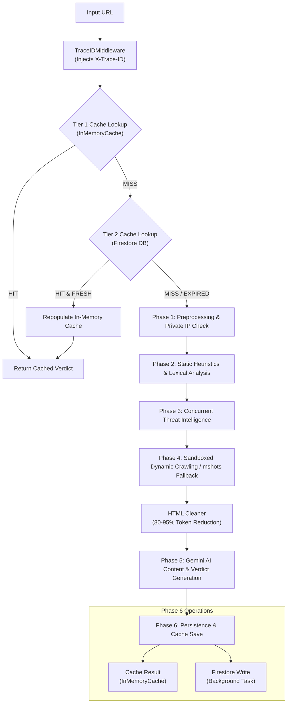
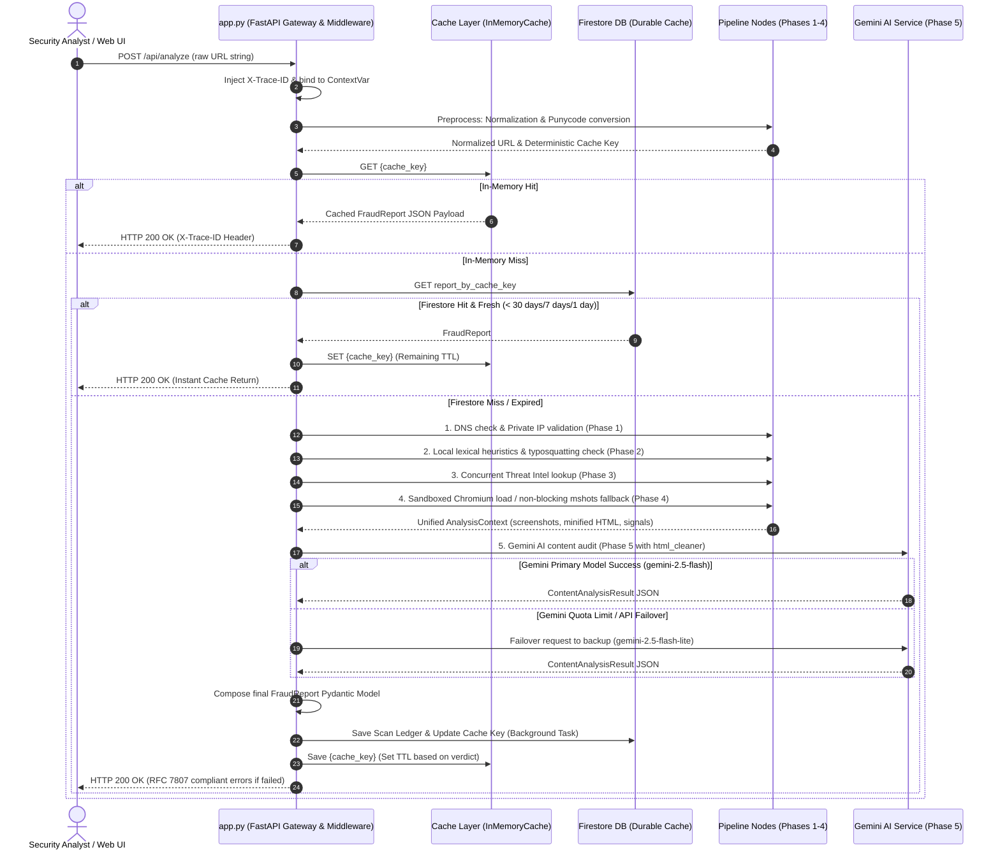

# 🛡️ Enterprise AI URL Safety & Fraud Detection Platform

Welcome to the **Enterprise AI URL Safety & Fraud Detection Platform**—a modular, native asynchronous, multi-phase threat assessment pipeline designed to inspect, validate, analyze, and neutralize malicious URLs. 

By combining **static lexical heuristics**, **brand-spoofing detection**, **multi-provider Threat Intelligence (Threat Intel) aggregation**, **sandboxed dynamic browser execution**, **HTML token compression**, and **generative AI reasoning**, this platform offers a deep, 360-degree security assessment of any incoming URL or domain.

---

## 🚀 Enterprise Key Capabilities

*   **Native Async Cascade Pipeline**: Powered by Python's native `async`/`await` event loop to execute intensive external APIs and sandboxed browser navigations concurrently without thread pool overhead, achieving sub-second verdicts for fast/cached exits (~0.07s).
*   **HTTP Connection Pooling**: Global `httpx.AsyncClient` connection pool (`max_connections=100`, `max_keepalive_connections=20`) with FastAPI `lifespan` management preventing ephemeral port exhaustion.
*   **HTML Minification & Token Reduction**: Built-in HTML sanitizer (`html_cleaner.py`) strips non-semantic scripts, styles, inline base64 images, and attributes, cutting Gemini LLM prompt token costs by **80% - 95%**.
*   **Non-Blocking WordPress mshots Fallback**: Instant non-blocking mshots URL assignment (`https://s0.wp.com/mshots/v1/...`) for direct frontend rendering, eliminating 7-second server-side delay.
*   **Distributed Tracing & Structured Telemetry**: `TraceIDMiddleware` binds `X-Trace-ID` across coroutines using Python `contextvars` and formats structured JSON logs (`JSONFormatter`) for Datadog, GCP Cloud Logging, and Grafana Tempo.
*   **Enterprise Readiness & Liveness Probes**: Dedicated `/health/liveness` and `/health/readiness` probes evaluating live Firestore DB connections and outbound HTTP egress for Kubernetes / Cloud Run.
*   **RFC 7807 Global Error Handlers**: Standardized problem details JSON responses (`type`, `title`, `status`, `detail`, `instance`, `trace_id`) across all API errors (`ProviderError`, `HTTPException`, `Exception`).
*   **Resilient Threat Intel Orchestrator**: Queries multiple industry-standard security APIs (VirusTotal, Google Safe Browsing, URLhaus, AbuseIPDB, URLScan) in parallel with automatic rate limiters, token bucket protection, error isolation, and caching.
*   **2-Tier Caching & Persistent Ledger**: Automatically caches scan results using a robust 2-Tier Caching System (In-Memory + Firestore Fallback) with dynamic verdict-based expiration clocks.
*   **100% Tested Test Suite**: Comprehensive `unittest` suite covering 19 integration tests and 7 scenario tests with zero LLM API quota consumption (`SKIP_LLM_DEV=true`).

---

## 📂 Project Directory Structure

```directory
AI_agent/
├── .env                       # Environment configurations (API keys & endpoints)
├── .gitignore                 # Specifies intentionally untracked files
├── requirements.txt           # Python application dependencies
├── deploy.ps1                 # Deployment helper script
├── artifacts/                 # Saved execution assets (e.g., screenshots, logs)
├── src/                       # Primary Source Code Directory
│   ├── app.py                 # FastAPI Web Gateway, Middleware & Health Probes
│   ├── core/                  # Core Models, Settings, Logging & Connections
│   │   ├── http_client.py     # Global HTTP Connection Pool (httpx.AsyncClient)
│   │   ├── logging_config.py  # JSON Formatter & Trace ID ContextVar Manager
│   │   ├── enums.py           # Common enums (e.g. Risk levels)
│   │   ├── exceptions.py      # Base application errors
│   │   ├── models.py          # Unified Pydantic schema declarations
│   │   ├── settings.py        # Pydantic Settings Manager (loads .env)
│   │   ├── cache/             # Caching Engine (Memory + Firestore)
│   │   │   ├── base.py        # Cache interfaces
│   │   │   ├── memory_cache.py# Monotonic clock-safe local memory cache (MAX_SIZE=200)
│   │   │   └── factory.py     # Cache provider factory
│   │   ├── security/          # Security & Rate Limiting
│   │   │   ├── rate_limiter.py    # Route Token Bucket Rate Limiter
│   │   │   └── provider_limiter.py# Threat Intel Provider Rate Limiter
│   │   └── database/          # Persistence Layer
│   │       ├── base_repository.py      # Repository interface (with offset support)
│   │       ├── firestore_repository.py # Google Cloud Firestore adapter
│   │       └── storage_repository.py   # Firebase Storage screenshot adapter
│   ├── dns/                   # Custom DNS Resolution Modules
│   │   ├── cache.py           # TTL-respecting DNS query cache
│   │   └── resolver.py        # Secure DNS client
│   ├── agents/                # Native Async State Machine Engine
│   │   ├── runner.py          # Native Async AgentRunner execution engine
│   │   ├── state/             # State & Telemetry models
│   │   ├── tools/             # BaseTool & Tool Registries (Async Tools)
│   │   ├── nodes/             # Async Workflow Nodes (Validate, Static, Threat, Merge, Dynamic, AI, Report, Store)
│   │   └── checkpoint/        # In-Memory State Checkpoint Manager
│   ├── analyzers/             # Deep URL Inspection Analyzers
│   │   └── url/               
│   │       ├── preprocessing/ # Normalization & SSRF/Private IP checks
│   │       ├── static/        # Lexical heuristics, brand & typosquatting detection
│   │       ├── threat_intelligence/ # VT, GSB, URLScan, URLHaus (Auth-Key), AbuseIPDB
│   │       ├── dynamic_analysis/    # Playwright browser sandbox & Scraper failovers
│   │       └── ai_content_analysis/ # Gemini LLM audit & html_cleaner.py minifier
│   └── static/                # Web Dashboard Assets (HTML, CSS, JS)
└── tests/                     # Test Suites (unittest)
    ├── data/                  # Static test fixtures (login_page.html, obfuscated.html)
    ├── integration/           # Native Async Integration Tests (Runner, AI, Dynamic)
    └── run_scenarios.py       # Threat Intel Scenario Validator
```

---

## 🔄 The 6-Phase Analysis Pipeline

The system processes every URL through six progressive validation, detection, caching, and persistence phases:



---

## 🔄 End-to-End System Workflow

This diagram outlines the complete sequence of events when a request is dispatched to the platform:



---

## ⚙️ Enterprise API Endpoints

| Endpoint | Method | Description | Response Model / Format |
| :--- | :--- | :--- | :--- |
| `/api/analyze` | `POST` | Primary URL threat analysis endpoint. | `FraudReport` JSON |
| `/api/history` | `GET` | Fetches recent scan history summaries (supports `limit`, `offset`, `search`, `verdict`). | `Array<SummaryObject>` |
| `/api/history/{scan_id}` | `GET` | Retrieves detailed report by document ID. | `FraudReport` JSON |
| `/health` | `GET` | Process health check. | `{"status": "healthy", "trace_id": "..."}` |
| `/health/liveness` | `GET` | Kubernetes Liveness Probe. | `{"status": "healthy", ...}` |
| `/health/readiness` | `GET` | Kubernetes Readiness Probe (Pings Firestore & Egress HTTP). | `{"status": "ready", "database": "connected", "egress_http": "connected"}` |

---

## 🛠️ Installation & Setup

### Prerequisites
*   Python 3.10+
*   Google Cloud Firestore Database (or local Firebase Emulator Suite)

### 1. Clone & Setup Virtual Environment
```bash
git clone https://github.com/lequanganhtuan/AI_agent.git
cd AI_agent
python -m venv venv
venv\Scripts\activate      # Windows
# or: source venv/bin/activate  # macOS/Linux
```

### 2. Install Dependencies
```bash
pip install -r requirements.txt
playwright install chromium
```

### 3. Configure Environment Variables
Create a `.env` file in the root directory. Fill in your API keys:
```ini
ENVIRONMENT=development
DEBUG=True
JSON_LOGGING=false                             # Set to true for JSON structured logging

# Third-Party APIs
VIRUSTOTAL_API_KEY=your_virustotal_api_key_here
GOOGLE_SAFE_BROWSING_API_KEY=your_google_safe_browsing_api_key_here
URLSCAN_API_KEY=your_urlscan_api_key_here
URLHAUS_API_KEY=your_urlhaus_api_key_here
ABUSEIPDB_API_KEY=your_abuse_ip_db_api_key_here
GEMINI_API_KEY=your_gemini_api_key_here

# Storage & Cache
FIRESTORE_PROJECT_ID=second-core-501608-a5
FIRESTORE_DATABASE_ID=(default)
FIRESTORE_EMULATOR_HOST=127.0.0.1:8080               # Set when running emulators locally
CACHE_TTL=86400                                      # TTL for normal domain caches (in seconds)

# Whitelist Configuration
SAFE_WHITELIST_DOMAINS="
google.com
gmail.com
youtube.com
facebook.com
"
```

---

## 🎮 Running the Server & Testing

### Running the Web Application
Launch the FastAPI server:
```bash
uvicorn src.app:app --reload --host 127.0.0.1 --port 8000
```
Open your browser and navigate to `http://127.0.0.1:8000`.

### Running Integration & Scenario Tests (100% Passed)
To run the native `unittest` integration suite without consuming LLM API quota:

```bash
# Windows PowerShell
$env:PYTHONPATH="."; $env:SKIP_LLM_DEV="true"; & venv\Scripts\python.exe -m unittest discover -s tests/integration

# macOS/Linux Terminal
PYTHONPATH=. SKIP_LLM_DEV=true venv/bin/python -m unittest discover -s tests/integration
```

To run the Threat Intelligence scenarios:
```bash
# Windows PowerShell
$env:PYTHONPATH="."; $env:SKIP_LLM_DEV="true"; & venv\Scripts\python.exe tests/run_scenarios.py

# macOS/Linux Terminal
PYTHONPATH=. SKIP_LLM_DEV=true venv/bin/python tests/run_scenarios.py
```

```text
----------------------------------------------------------------------
Ran 19 tests in 177.779s

OK
```

---

## 🛡️ Enterprise Security & Protection

> [!IMPORTANT]
> *   **SSRF Protection**: Private IPs (`127.0.0.1`, `10.0.0.0/8`, `192.168.0.0/16`, `localhost`) are automatically intercepted in Phase 1 to prevent internal network probing.
> *   **Rate Limiting**: API routes apply Token Bucket rate limiters (`analyze_rate_limit_dependency`, `history_rate_limit_dependency`) and provider-level rate limiters (`ProviderLimiter`).
> *   **OOM Prevention**: `InMemoryCache` enforces `MAX_CACHE_SIZE = 200` and `scan_semaphore` limits concurrent headless Playwright instances.
