# 🛡️ Enterprise AI URL Safety & Fraud Detection Platform

Welcome to the **Enterprise AI URL Safety & Fraud Detection Platform**—a modular, asynchronous, multi-phase threat assessment pipeline designed to inspect, validate, analyze, and neutralize malicious URLs. 

By combining **static lexical heuristics**, **brand-spoofing detection**, **multi-provider Threat Intelligence (Threat Intel) aggregation**, **sandboxed dynamic browser execution**, and **generative AI reasoning**, this platform offers a deep, 360-degree security assessment of any incoming URL or domain.

---

## 🚀 Key Capabilities

*   **Asynchronous Processing**: Powered by Python's `asyncio` to execute intensive external APIs and sandboxed browser navigations concurrently, achieving low-latency verdicts.
*   **Decoupled Multi-Phase Architecture**: Separates parsing, static features, external threat databases, live page behavior, and AI evaluation into independent layers.
*   **Resilient Threat Intel Orchestrator**: Queries multiple industry-standard security APIs (VirusTotal, Google Safe Browsing, PhishTank, URLhaus, AbuseIPDB, URLScan) in parallel with automatic timeouts, error isolation, and caching.
*   **Headless Dynamic Analysis**: Spawns an automated Playwright Chromium instance to capture redirect chains, sniff network traffic, audit DOM inputs (for credential harvesting/OTPs), execute script telemetry, and capture screenshot evidence.
*   **Google Gemini AI Content Audit**: Uses Google's generative AI (with primary and backup fallback model pipelines) to analyze visual, textual, and behavioral metadata, generating natural language reasoning and safety recommendations.
*   **Dual-Layer Caching & Persistent Ledger**: Automatically caches scan results using namespaced Redis keys or a robust local in-memory clock-safe cache. Integrates serverless Google Cloud Firestore to maintain a searchable, filterable historical record of scans.
*   **Interactive Web UI Dashboard**: Renders real-time risk gauges, redirect paths, screenshots, diagnostic copy-paste prompt testers, and a slide-out Scan History drawer.

---

## 📂 Project Directory Structure

```directory
AI_agent/
├── .env                       # Environment configurations (API keys & endpoints)
├── .gitignore                 # Specifies intentionally untracked files
├── requirements.txt           # Python application dependencies
├── run_dynamic_scenarios.py   # Executable script simulating live dynamic crawls
├── test.ipynb                 # Interactive Jupyter notebook for prototyping
├── artifacts/                 # Saved execution assets (e.g., screenshots, logs)
│   └── scenarios_screenshots/
├── src/                       # Primary Source Code Directory
│   ├── app.py                 # FastAPI Web Application & API Gateway
│   ├── core/                  # Core Models, Settings, and Exceptions
│   │   ├── enums.py           # Common enums (e.g. Risk levels)
│   │   ├── exceptions.py      # Base application errors
│   │   ├── models.py          # Unified Pydantic schema declarations
│   │   ├── settings.py        # Pydantic Settings Manager (loads .env)
│   │   ├── cache/             # Dual-layer Caching Engine
│   │   │   ├── base.py        # Cache interfaces
│   │   │   ├── memory_cache.py# Monotonic clock-safe local memory cache
│   │   │   ├── redis_cache.py # Namespaced async Redis implementation
│   │   │   └── factory.py     # Cache provider fallback factory
│   │   └── database/          # Persistence Layer
│   │       └── firestore_repository.py # Google Cloud Firestore adapter
│   ├── dns/                   # Custom DNS Resolution Modules
│   │   ├── cache.py           # TTL-respecting DNS query cache
│   │   ├── resolver.py        # Secure DNS client
│   │   └── dnspython_resolver.py
│   ├── analyzers/             # Deep URL Inspection Analyzers
│   │   ├── base.py            # Base Analyzer interface
│   │   └── url/               # Specialized URL Analysis components
│   │       ├── preprocessing/ # Normalization & validation checks
│   │       ├── static/        # Lexical heuristics, brand & typosquatting detection
│   │       ├── threat_intelligence/ # 3rd-party Threat Intel integrations
│   │       └── dynamic_analysis/    # Headless Playwright browser sandbox
│   └── static/                # Web Dashboard Static Assets
│       ├── index.html         # Dashboard template
│       ├── style.css          # Sleek glassmorphism styled layout
│       └── script.js          # Interactive frontend rendering & request loop
└── tests/                     # Unit & Integration Test Suites
    ├── data/                  # Static test fixtures
    ├── unit/                  # Modular unit tests (Static, DNS, Preprocessing)
    ├── integration/           # Multi-component pipeline tests
    └── run_scenarios.py       # Phase 3 Threat Intel logic validator
```

---

## 🔄 The 6-Phase Analysis Pipeline

The system processes every URL through six progressive validation, detection, caching, and persistence phases:

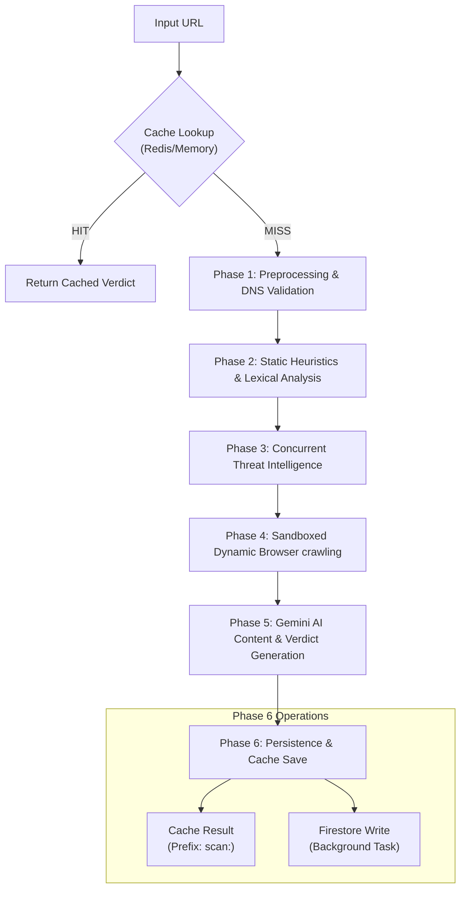

---

## 🔄 End-to-End System Workflow

This diagram outlines the complete sequence of events when a request is dispatched to the platform:

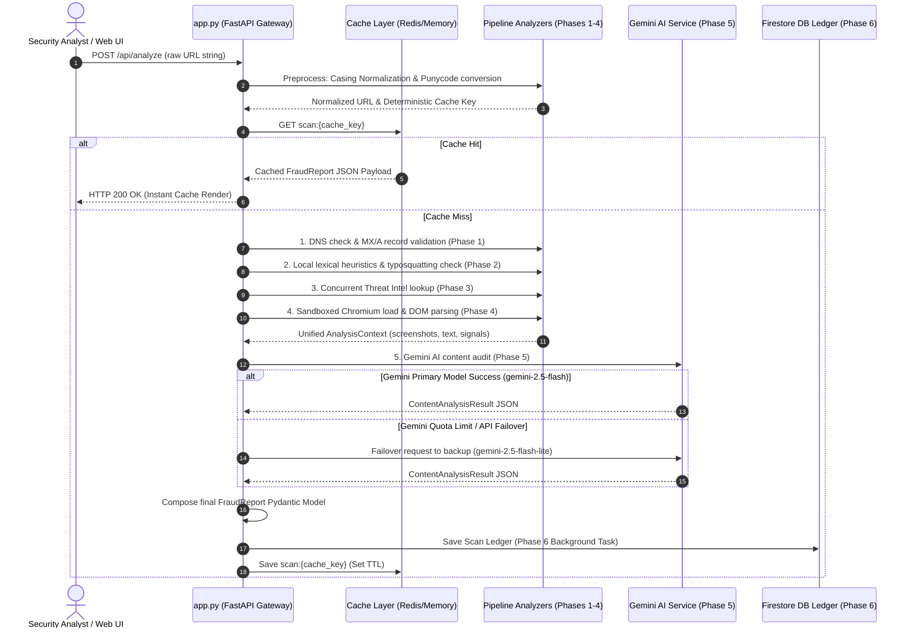

> [!TIP]
> For a highly detailed architectural flowchart illustrating internal file names, class definitions, parallel execution branches, error failovers, and Firestore persistence, refer to the [DETAILED_WORKFLOW.md](DETAILED_WORKFLOW.md) guide.

### 📋 Technical Execution Sequence

| Step | System Component | Core Execution Process | Input / Output Formats | Failure Recovery / Isolation |
| :--- | :--- | :--- | :--- | :--- |
| **1** | **API Gateway** (`app.py`) | Receives raw request, normalizes query params, standardizes case formats, and generates the cache key. | **In**: `AnalyzeRequest` (string)<br>**Out**: Cache key string | Client-side validation returns standard HTTP 400 if syntax is malformed. |
| **2** | **Cache Check** (`factory.py`) | Inspects local thread-safe memory storage or active Redis instance for namespaced key `scan:{key}`. | **In**: Cache key string<br>**Out**: `FraudReport` or `None` | **Fail-Open Strategy**: If Redis connection fails, prints warning and proceeds directly to query analysis pipeline. |
| **3** | **DNS Validation** (`resolver.py`) | Checks domain record resolution (A, AAAA, MX) and caches results to prevent redundant network lookups. | **In**: Hostname<br>**Out**: `ValidationResult` | If domain fails to resolve to any active IP address, the scan is terminated instantly with HTTP 400. |
| **4** | **Static Analyzer** (`static_url_analyzer.py`) | Measures entropy, checks combosquatting lists, and executes typosquatting Levenshtein check. | **In**: `ValidationResult`<br>**Out**: `StaticRiskAnalysis` | Rules-based engine with no outbound network dependencies. Failures are isolated locally. |
| **5** | **Threat Intel Orchestrator** (`orchestrator.py`) | Dispatches 5 concurrent thread tasks to query VirusTotal, SafeBrowsing, AbuseIPDB, URLScan, and URLhaus. | **In**: Domain & IPs<br>**Out**: `ThreatIntelligenceResult` | Individual API failures or rate limits are isolated. Confidence score dynamically scales down based on failed lookups. |
| **6** | **Browser Sandbox** (`browser_engine.py`) | Launches Playwright chromium browser, logs redirects, audits DOM elements (password/OTP inputs), and saves screenshots. | **In**: Target URL<br>**Out**: `DynamicAnalysisResult` | Playwright errors are caught, returning a `failed` status result so the main analysis is not blocked. |
| **7** | **Gemini AI service** (`service.py`) | Submits page screenshot, clean text, and signals metadata. Auto-fails over to backup model if quota exceeded. | **In**: `AIAnalysisInput`<br>**Out**: `AIAnalysisResult` | Exceptions are caught, falling back to writing prompts to the UI copy-paste diagnostic card. |
| **8** | **Score Suppression** (`calculator.py`) | Overrides final score to `0.0` if Gemini recommends `ALLOW` to prevent false positive alarms on official brand pages. | **In**: AISignals & Verdict<br>**Out**: `AIRisk` | Scoring is strictly deterministic. Suppresses all login-field signals for verified domains. |
| **9** | **Persistence Task** (`firestore_repository.py`) | Serializes report Pydantic structure and writes to Cloud Firestore in the background to prevent user load blocking. | **In**: `FraudReport`<br>**Out**: Firestore Document ID | Database writing is handled as a background task. If GCP fails, logs error without disrupting UI display. |

---

### Phase 1: Preprocessing & DNS Validation
*   **Validation**: Asserts URL structure, extracts parameters, and intercepts private IPs or invalid formats before executing outbound queries.
*   **Normalization**: Corrects casing, trims whitespace, standardizes query parameters, and handles Punycode internationalized domains to establish a deterministic cache key.
*   **DNS Resolution**: Checks actual domain viability via a custom resolver featuring a thread-safe, TTL-sensitive caching system.

#### ⚙️ Technical Workflow
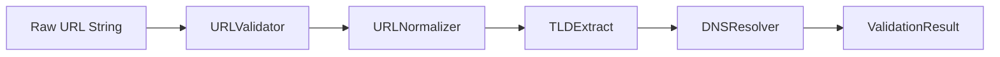
*   **Input**: Raw user URL string (e.g. `http://example.com/path?query=val`).
*   **Output**: `ValidationResult` containing parsed components (scheme, domain, TLD), hostname viability status, and the computed deterministic `cache_key`.

#### 📸 Visual Interface (Input & Validation Phase)
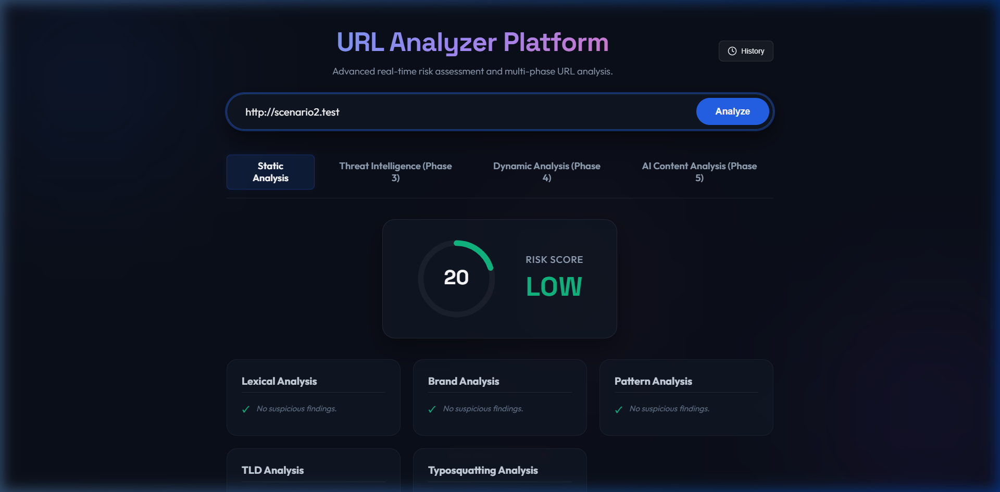

---

### Phase 2: Static Heuristics & Lexical Analysis
Checks properties of the URL itself without making network calls to external sites:
*   **Lexical Features**: Computes entropy, digit ratios, depth, token lengths, and special characters.
*   **Brand Spoofing**: Compares the target domain against lists of high-traffic brands to identify phishing targets.
*   **Typosquatting/Combosquatting**: Applies Levenshtein distance metrics to catch lookalike domains (e.g., `g00gle.com`, `paypal-security-update.net`).
*   **TLD Check**: Matches top-level domains against a list of high-risk spam or malware registrars.

#### ⚙️ Technical Workflow
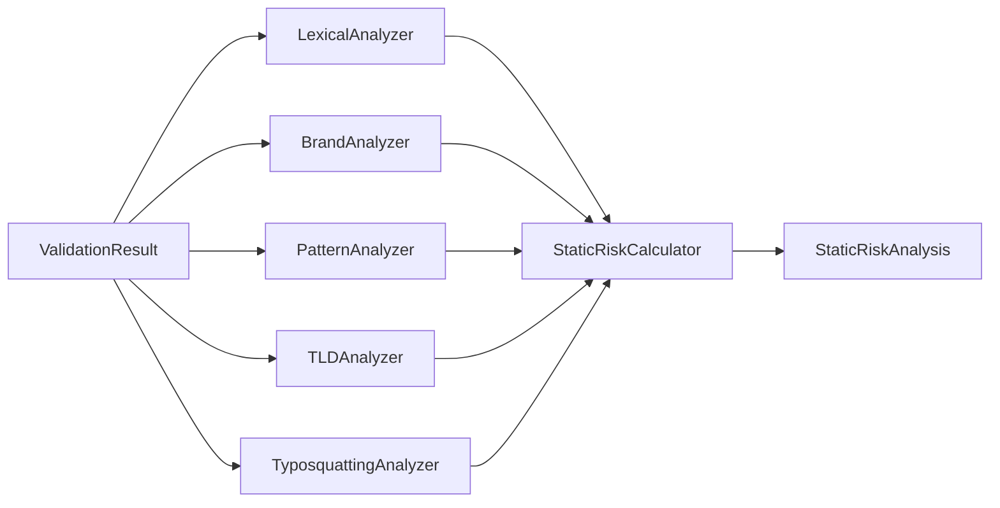
*   **Input**: `ValidationResult` model.
*   **Output**: `StaticRiskAnalysis` containing a rules-based threat score (clamped to 100), active signals, and visual summaries.

#### 📸 Visual Interface (Static Analysis Widgets)
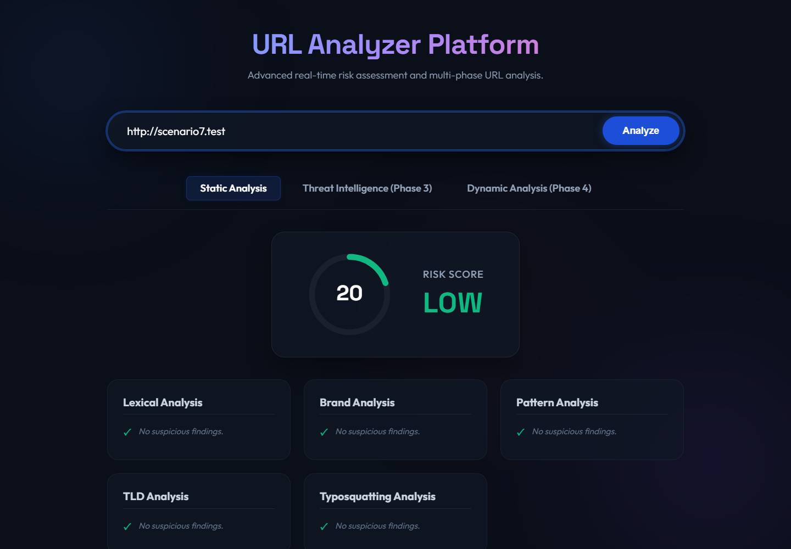

---

### Phase 3: Parallel Threat Intelligence
Aggregates live reputation data from multiple providers concurrently:
*   **VirusTotal**: Checks detection engines and file-reputation counts.
*   **Google Safe Browsing**: Flags malware, phishing, and social engineering hazards.
*   **AbuseIPDB**: Assesses host IP reputation, reports count, and hosting metadata.
*   **URLhaus**: Queries active malware payload distribution lists.
*   **URLScan**: Identifies behavioral and site-level hazards.
*   **Error Tolerance**: Gracefully isolates provider failures or timeouts, adjusting the overall **Confidence Score** proportional to the succeeded lookups.

#### ⚙️ Technical Workflow
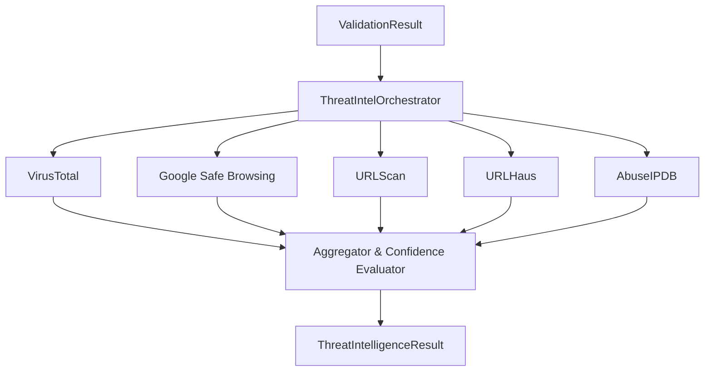
*   **Input**: `ValidationResult` containing host IPs.
*   **Output**: `ThreatIntelligenceResult` wrapping results from all 5 providers, aggregate hit signals, and a computed confidence score.

#### 📸 Visual Interface (Concurrent Threat Reputations)
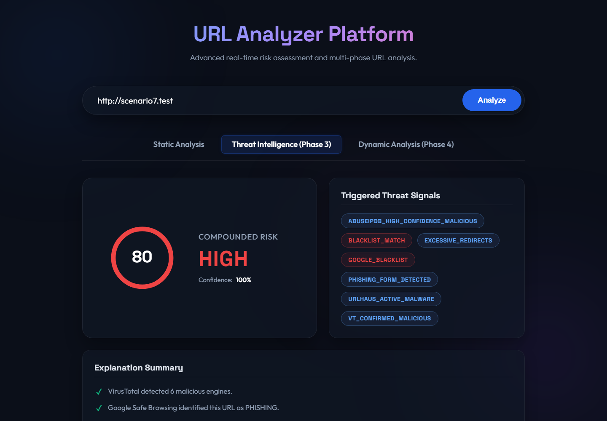

---

### Phase 4: Sandboxed Dynamic Browser Crawling
A live headless crawler visits the site inside a secure Playwright environment:
*   **Redirect Chains**: Captures all HTTP and meta-refresh redirects, tracking cross-domain jumps and loops.
*   **DOM Auditing**: Scans for hidden iframes, JavaScript obfuscation tags (such as excessive `eval()`, `atob()`, or `unescape()`), and forms gathering sensitive fields (e.g. Passwords, OTPs, Identity Cards, Credit Cards).
*   **Network Sniffing**: Inspects API endpoints, WebSocket activities, and CDN connections during loading.
*   **Visual Evidence**: Captures full-page screenshots for security operators to audit.

#### ⚙️ Technical Workflow
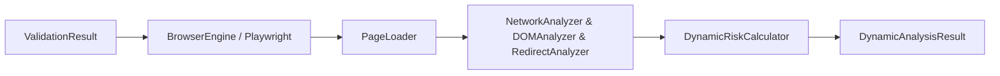
*   **Input**: `ValidationResult` (URL targeted).
*   **Output**: `DynamicAnalysisResult` containing full-page screenshot path, redirect timelines, DOM input form classifications, network packet counts, and a computed dynamic score.

#### 📸 Visual Interface (Automated Playwright Crawl)
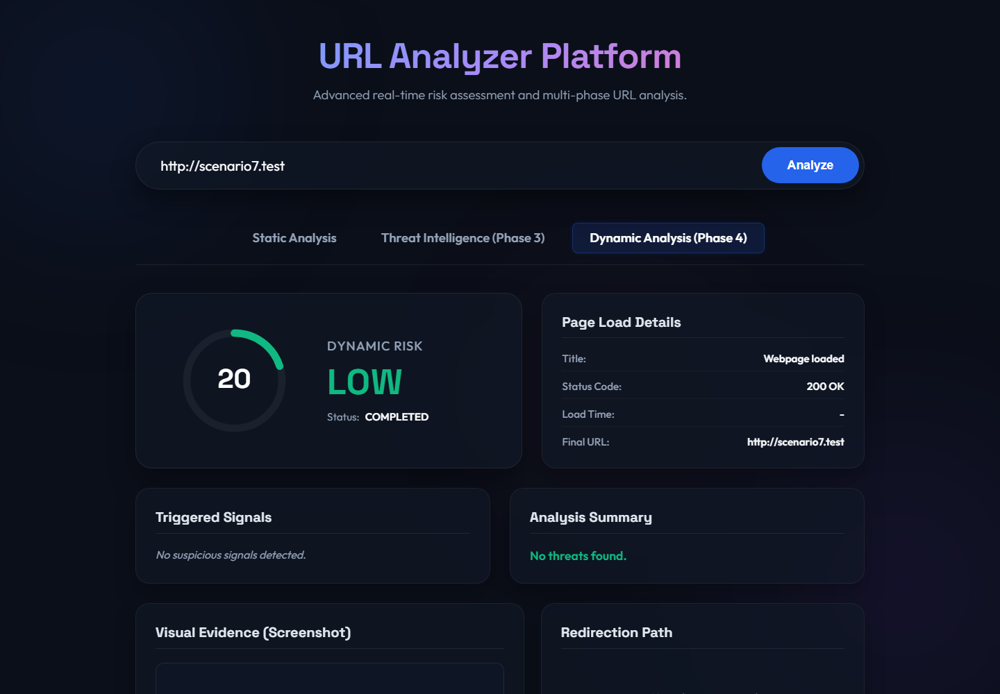

---

### Phase 5: AI Content Analysis & Reasoning
An LLM content analyzer (Google Gemini) processes the combined data to produce a final security verdict:
*   **Primary/Backup Failover**: Integrates primary model `gemini-2.5-flash` with automatic failover to `gemini-2.5-flash-lite` if the primary model fails.
*   **Composite Risk Scoring**: Computes a deterministic composite risk score combining signal weights, severity multipliers, and the model's confidence. Enforces safety-net score floors based on the recommended verdict (e.g., minimum score of 70 for a `BLOCK` recommended action) to guarantee threat scores match policy decisions.
*   **Official Brand Suppression**: Automatically suppresses threat scores to `0.0` when the recommended action is `ALLOW` (e.g., official domains like `google.com`, `instagram.com`).

#### ⚙️ Technical Workflow
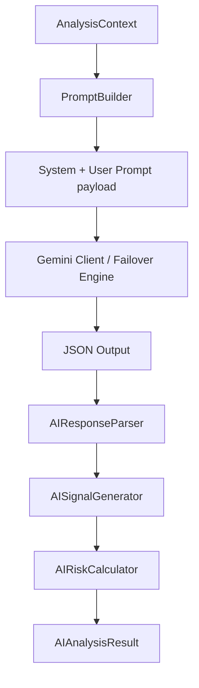
*   **Input**: Entire accumulated pipeline `AnalysisContext` and browser page HTML string.
*   **Output**: `AIAnalysisResult` containing Gemini website purpose classification, brand confidence, reasoning steps, AI signals, and final composite threat score.

#### 📸 Visual Interface (Google Gemini Safety Verdicts & Prompt Diagnostics)
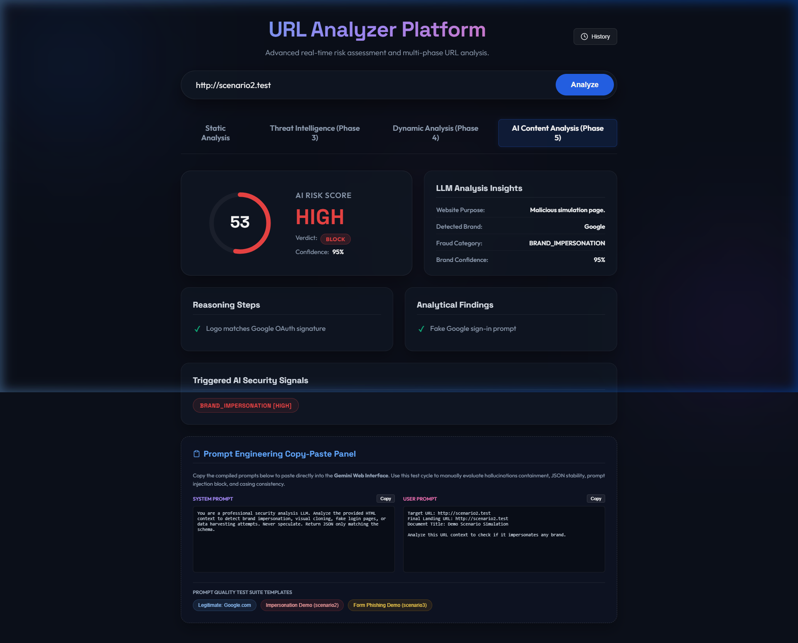

---

### Phase 6: Persistence & Cache Management
*   **Dual-Layer Cache**: Searches for cache keys under a prefix namespace (`scan:{cache_key}`) with an async Redis manager or falls back to an local `InMemoryCache` using monotonic clocks to prevent clock-drift issues.
*   **Firestore Database History**: Persists complete, structured `FraudReport` documents in Google Cloud Firestore as a background task.
*   **Scan History Sidebar**: Features a sliding side drawer to fetch, search, and filter past scans locally, reloading historical records instantly.

#### ⚙️ Technical Workflow
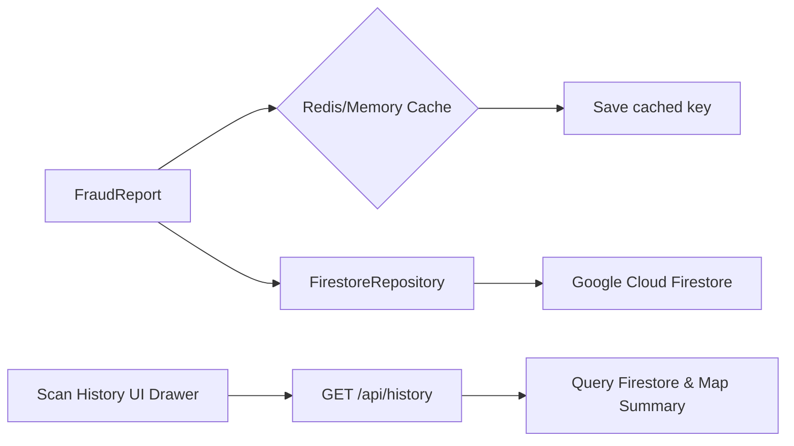
*   **Input**: Completed `FraudReport` instance.
*   **Output**: Saved cache payload, Firestore document ID, and searchable sidebar list cards.

#### 📸 Visual Interface (Scan Ledger History Sidebar)
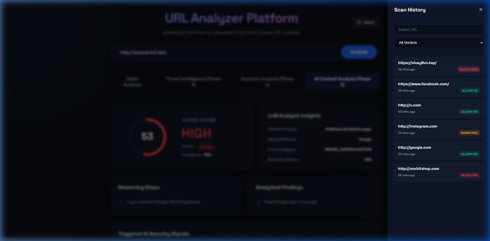

---

## 🛠️ Installation & Setup

### Prerequisites
*   Python 3.10+
*   Google Cloud Firestore Database
*   Redis server (optional, for Redis-backed caching)

### 1. Clone & Setup Virtual Environment
```bash
git clone <repository-url>
cd AI_agent
python -m venv venv
venv\Scripts\activate      # Windows
# or: source venv/bin/activate  # macOS/Linux
```

### 2. Install Dependencies
```bash
pip install -r requirements.txt
playwright install chromium
```

### 3. Configure Environment Variables
Create a `.env` file in the root directory. Fill in your API keys:
```ini
ENVIRONMENT=development
DEBUG=True

# Third-Party APIs
VIRUSTOTAL_API_KEY=your_virustotal_api_key_here
GOOGLE_SAFE_BROWSING_API_KEY=your_google_safe_browsing_api_key_here
URLSCAN_API_KEY=your_urlscan_api_key_here
URLHAUS_API_KEY=your_urlhaus_api_key_here
ABUSEIPDB_API_KEY=your_abuse_ip_db_api_key_here
GEMINI_API_KEY=your_gemini_api_key_here

# Storage & Cache (Phase 6)
FIRESTORE_PROJECT_ID=your_gcp_project_id
FIRESTORE_DATABASE_ID=your_firestore_database_id
GOOGLE_APPLICATION_CREDENTIALS=D:\Study\test\Audio\ai_engineer\DP\week10\AI_agent\your-service-account-key.json
REDIS_URL=redis://localhost:6379
CACHE_TTL=86400
```

---

## 🎮 Running the Platform

### Running the Web Application
Launch the FastAPI server:
```bash
uvicorn src.app:app --reload --host 127.0.0.1 --port 8000
```
Open your browser and navigate to `http://127.0.0.1:8000`.

### Running Dynamic Scenario Crawler (Terminal)
To run automated crawling scenarios directly from the CLI:
```bash
python run_dynamic_scenarios.py
```
This runs 11 different test URLs (Google, Github login flow, TinyURL redirect, active websocket connections, faulty paths, private IPs, etc.) and exports screenshot evidence into `artifacts/scenarios_screenshots/`.

---

## 🧪 Simulation Harness & Scenarios

To help test the scoring engine and pipeline robustness, the Web App features mock scenario interception when inputting testing URLs:

| Scenario | Trigger URL pattern | Description | Expected Risk & Signals |
| :--- | :--- | :--- | :--- |
| **Scenario 1** | `*scenario1*.test` | Completely clean website mockup. | `LOW` Risk, 0 score. |
| **Scenario 2** | `*scenario2*.test` | Blacklist detection simulator. | `MEDIUM` Risk, triggers `GOOGLE_BLACKLIST` & `VT_CONFIRMED_MALICIOUS`. |
| **Scenario 3** | `*scenario3*.test` | Behavioral credential harvest simulation. | `MEDIUM` Risk, triggers `PHISHING_FORM_DETECTED`. |
| **Scenario 4** | `*scenario4*.test` | Preserves IP/Proxy reputation simulation. | `MEDIUM` Risk, triggers `ABUSEIPDB_HIGH_CONFIDENCE_MALICIOUS`. |
| **Scenario 5** | `*scenario5*.test` | API provider timeout / failure handling. | `LOW` Risk, confidence score drops to `0.8`. |
| **Scenario 6** | `*scenario6*.test` | Cache Hit simulation. | `MEDIUM` Risk, instant payload return. |
| **Scenario 7** | `*scenario7*.test` | All threat buckets compounded. | `HIGH` Risk, maximum composite score of `80`. |

To run the pipeline verification scenario unit tests:
```bash
pytest tests/run_scenarios.py
```

---

## 🛡️ Security & Sandboxing Considerations

> [!WARNING]
> Dynamic analysis crawls live URLs. Crawling active threat vectors could trigger drive-by downloads or browser-level exploits.
> *   Ensure the host executing dynamic crawls resides in an isolated network segment (DMZ/VPC).
> *   Do not disable Playwright's `NO_SANDBOX` flag in production environments.
> *   Use API token rate-limiting to prevent exceeding quota thresholds on provider platforms.
